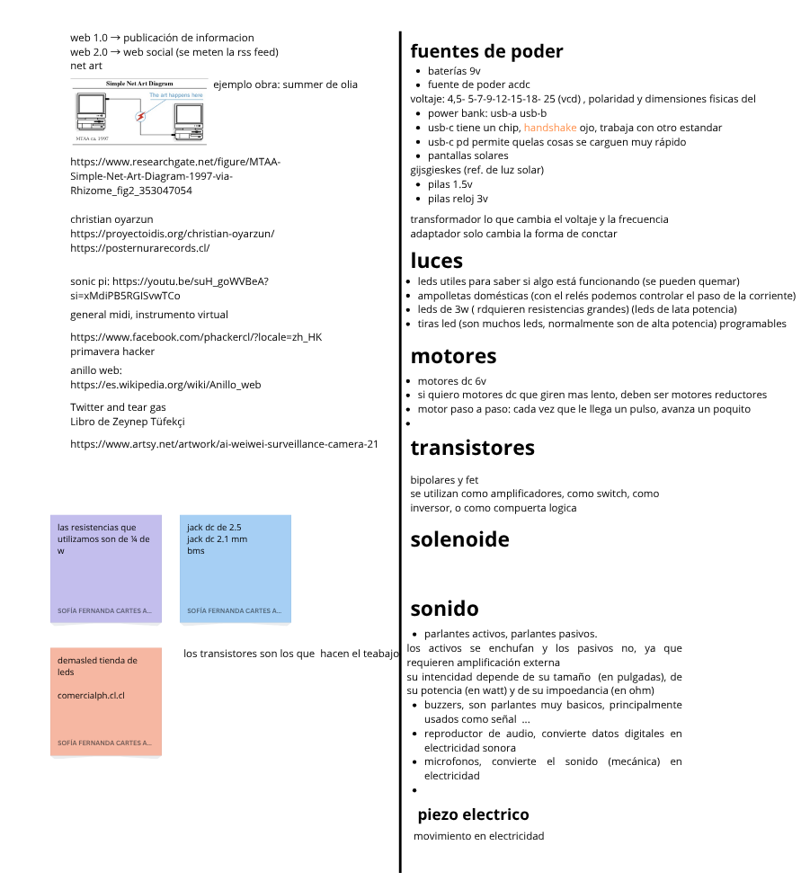

# sesion-12b 30/05

## Apuntes clase

|fuentes de poder|
|---|
|baterias 9v|
|fuente de poder AC DC|
|power bank: USB-A USB-B|
|USB-C tiene un chip, handshake. **trabaja con otro estandar**|
|USB-C pd permite quelas cosas se carguen muy rapido|
|pantallas solares|
|pilas 1.5v|
|pilas reloj 3v|
|**voltaje: 4,5- 5-7-9-12-15-18- 25 (vcd) , polaridad y dimensiones fisicas**|

_transformador lo que cambia el voltaje y la frecuencia
adaptador solo cambia la forma de conctar_

|luces|
|---|
|LEDS utiles para saber si algo está funcionando (se pueden quemar)|
|ampolletas domesticas (con el relés podemos controlar el paso de la corriente)|
|LEDS de 3w ( rdquieren resistencias grandes) (LEDs de alta potencia)|
|tiras LED (son muchos LEDS, normalmente son de alta potencia) programables|

|motores|
|---|
|motores DC 6v|
|motores DC que giren mas lento -> **motores reductores**|
|motor paso a paso: cada vez que le llega un pulso, avanza un poquito|

|transistores|
|---|
|bipolares|
|FET|

_se utilizan como amplificadores, como switch, como inversor, o como compuerta logica._

|solenoide|
|---|
|crea un campo magnético uniforme e intenso en su interior|

|sonido|
|---|
|parlantes activos (se enchufan)|
|parlantes pasivos (no se enchufan) **requieren amplificación externa** |
|buzzers (son parlantes básicos) principalmente usados como señal|
|reproductor de audio (convierte datos digitales en electricidad sonora)|
|microfonos (convierte el sonido (mecánica) en electricidad)|

la intensidad depende de su tamaño (en pulgadas), de su potencia (en watts) y de su impedancia (en ohm).

|piezo eléctrico|
|---|
|movimiento en electricidad|

## Encargo 24

Describir de forma textual 3 proyectos de maquinas electrónicas que quieran hacer de forma individual, ordenar por preferencia o interés de que sea desarrollado.

1. lámpara interactiva -> lámpara que con sensor de movimiento se encienda y se apague y que pueda cambiar su tipo de luz.

## Encargo 25

Dibujar diagrama de comportamiento, flujos de interaccion. No específicar chips. Considerar procesos de manera especulativa. ¿Cuanto tiempo se usará? ¿Qué encendidos y apagados tiene? ¿Cómo se interactua?

### 1

BOM

|componente| cantidad|
|---|---|
|bateria|1|
|sensor de proximidad|1|
|relé|1|
|LED||
|resistencias||
|capacitores||
|comparador de voltaje||

Se utilizara a medida que la uz sea escaza en lugares, tipo habitaciones. contara con el ON/OFF mediante sensor de movimiento sobre la lampara. Tambien variara el tipo de luz, cálida, fria o de colores, dependiendo la necesidad momentánea del usuario, el cual tambiés sera mediante movimiento, uno distinto al de encendido y apagado.

Potr otra parte sera una lámpara de pie, utilizando madera como su base y con una pantalla para el traspaso de luz.  

