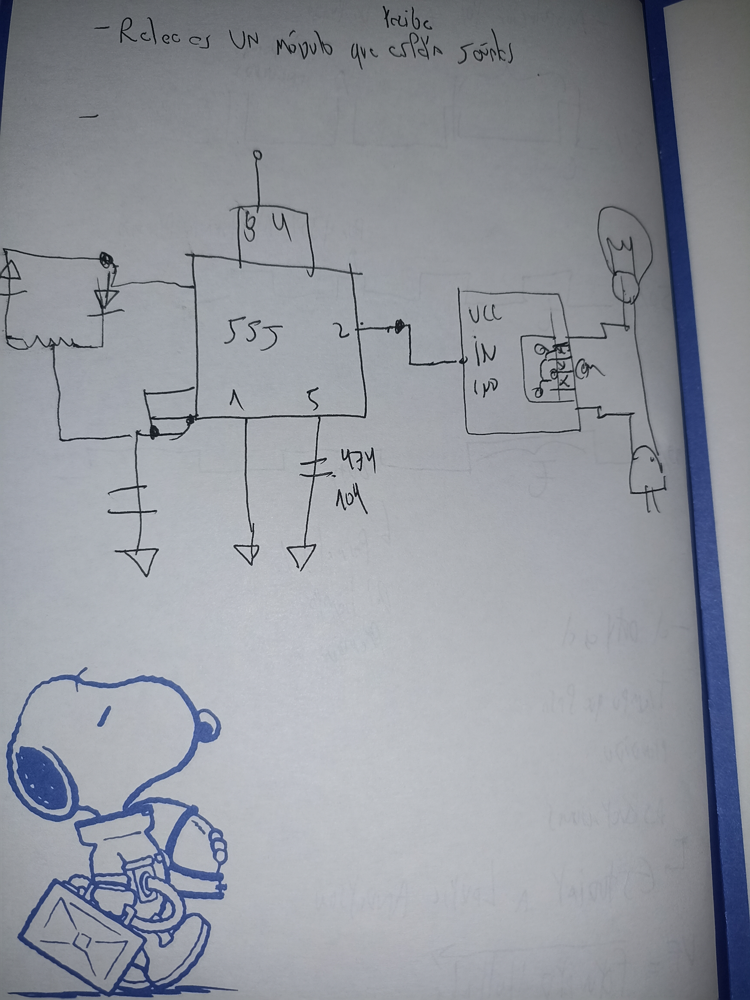
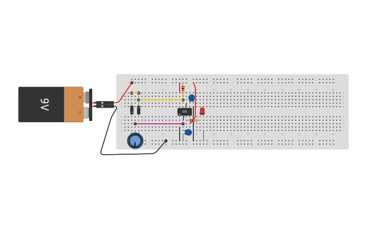
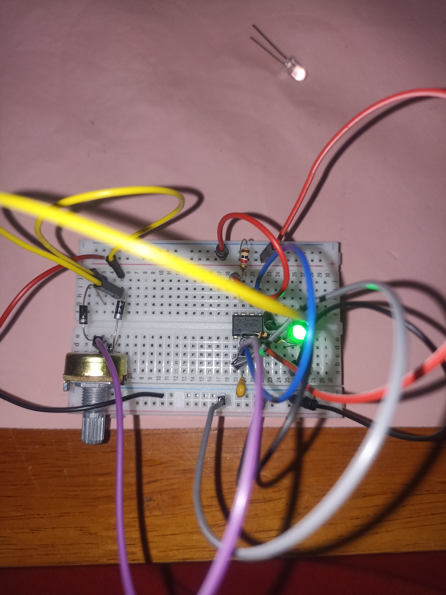
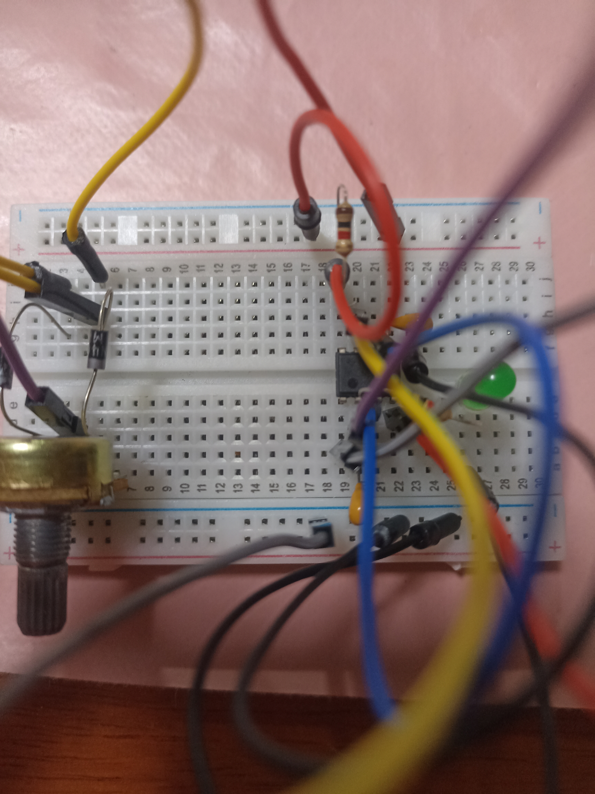
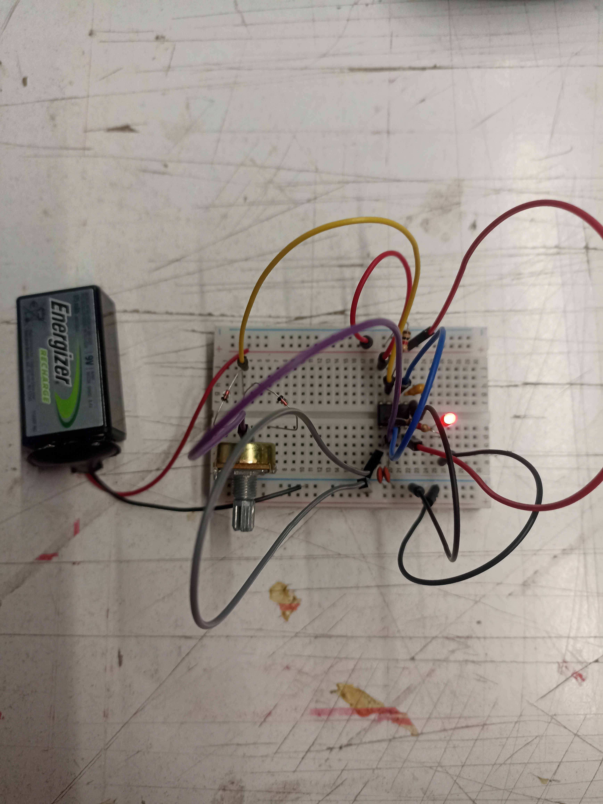
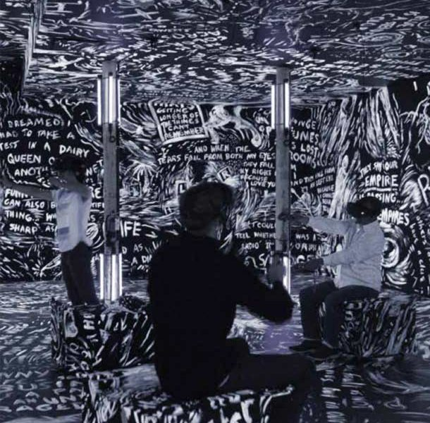
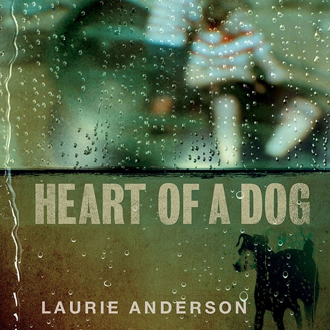
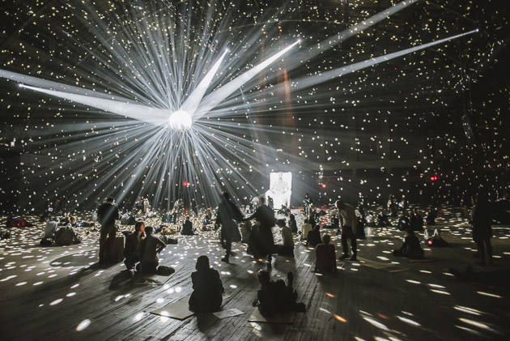
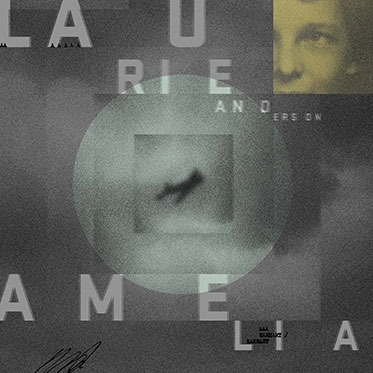

# sesion-09b

## taller clase 9b 9 de mayo de 2025

llegué un poco tarde

## primera parte

- cuando llegué estaban hablando del concepto de práctica situada, creo que estaban mostrando algo relacionado con eso
- ¿qué es una práctica situada?, es cómo podemos reconectar con el sitio en donde uno se mueve, algo de lo que alcancé a escuchar fue eso
- después se habló del "land art" como le dicen los gringos, dieron el ejemplo de las huellas de nazca
- también fue nombrado el new york earth room, una obra de Walter de Maria, que consiste en un departamento de new york lleno de tierra en su totalidad. Lo encontré curioso, me recordó a una backroom
- Gordon Matta Clark, hijo del chileno Roberto Matta, el papá nunca lo tomó en cuenta y murió joven. Era un anarquitecto como se definía él, sus obras eran lo contrario a arquitectura, le gustaba destruir y hacer agujeros en los edificios
- prácticas, emergencias tecnológicas
- hablaron de algo que iremos a ver respecto a diseño, a saber qué está pasando en la escuela y qué están haciendo los demás. Acá Aarón dijo que "somos malos para celebrar los chilenos" me quedó dando muchas vueltas en la cabeza, creo que en este país nunca se reconocen los esfuerzos

- ### **QS top universities**

- nos metimos a un ranking de universidades a nivel mundial para ver en qué lugar estaban las universidades chilenas, las primeras eran las típicas (MIT,Oxford, Harvard, Cambridge, etc) después habían varias universidades chinas y también una de Singapur
- las universidades chilenas mejor ubicadas son la católica en lugar 93 creo y la chile en el 100yalgo , la Diego Portales estaba cerca del lugar 1000
- existen varios parámetros para generar este ranking
- considerando que la udp es relativamente nueva, ha escalado muy bien en el ranking si nos ponemos a pensar que hay universidades que existen hace 500 años

- ### **salud mental**

- los profes hablaron que durante nuestro receso se capacitaron en salud mental de estudiantes y que les proponían una actividad que consiste en preguntarle a los alumnos si había pasado algo bueno durante la semana
- varios contaron lo que había pasado, me quedo con el de félix que desbloqueó un logro de caminar 7 o 70km entre portales del nether en minecraft, debe jugar muchísimo.
- misaaa contó que había salido un tiny desk de jeff parker, era de jazz. Lo anoté porque ando en búsqueda de escuchar música nueva, siempre escucho lo mismo

## segunda parte post break

- me fui a comprar un pan con jamón y palta que era muy grande y me dió asco comerlo, pero comí galletas frac.
- en la vuelta del break nos entregaron un nuevo chip y más cosas, dentro de estas se encuentra el PAM8403 que es un amplificador de audio, hace que todo suene más fuerte
- mostraron la página afel.cl que es barata y rápida, no sé si es buena, creo que tiene las versiones charcha de las cosas. Dijeron que para un examen no comprarían ahí, es bueno saberloé
- también nos entregaron un rele de 01 canal, nos permite ingresar señales de control, es decir, que algo haga algo o no lo haga
- en esta parte del semestre nos centraremos en luces, acciones, prender motores y mover cosas, nos alejaremos del mundo del sonido
- **repasamos las configuraciones del 555**
- configuración astable = oscilación, no es estable, periodicidad. El comportamiento del astable es On/Of, sube/baja, prendido/apagado, es un oscilador binario, sus out serían: leds,sonido,on
- el turco mecánico: un truco para hacer que algo parezca muy sofisticado pero en realidad no lo es, tiene un truco bajo la manga. Mostraron que Napoleón jugó ajedrez contra un robot pero en realidad no era un robot, era una caja con una persona dentro que movía las fichas
- configuración monoestable
- in: RyC, el monoestable establece un tiempo de cuánto algo permanece encendido y apagado, una perturbación en el tiempo
- out: led, aviso, movimiento, sonido
- diagrama de flujo, los pasos a seguir para que algo funcione, ejemplo  detector de sombra ---> timer----> luz
- misaaa dió un ejemplo, hace un tiempo tenía un trabajo que era para detectar la cantidad de barcos de un canal, entonces fueron haciendo el paso a paso /diagrama de flujo para llegar a esto
- al final misaaa no trabajó más con ellos porque el jefe era republicano, yo hubiera hecho lo mismo que misaaa
- **Circuito PWM**, pulse width modulation --- > modulación por ancho de pulso
- en esta parte usaron tinkercad pero no lo utilicé porque no tenía internet en el celu y no me podía conectar al de la u
- **explicación diagramada del ancho de pulso**
- 
- **esquemático circuito PWM¨**

### encargo-18: de tinkercad a protoboard

traspasar circuito pwm hecho en tinkercad a protoboard

 no asistí el martes a clases por lo cual no estuve cuando revisaron el circuito armado en la protoboard, lo armé según estaba en el módulo de tinkercad pero aún así no funciona, no sé en que esté fallando. Lo que ocurre es que la luz led se enciende pero al girar el potenciómetro, no genera efecto alguno sobre la luz. En algo debo haberme equivocado pero no logro comprenderlo aún, adjunto fotos del circuito.

 

<https://github.com/user-attachments/assets/4e382456-b36f-415d-a4ec-26a28e4d2f01>

### actualización

pregunté en clases en qué había fallado el circuito y misaaa me ayudó amablemente, la falla estuvo ante mis ojos y no supe verlo, los cambios que hicimos al que tenía anteriormente fueron:

- se conectaron nuevos diodos a las patas que sobraban del potenciómetro, anteriormente los diodos no estaban conectados al potenciómetro sino que solamente estaba conectado el cable del medio, esto se había probado antes pero no funcionaba no sé por qué
- se cambiaron los condensadores 474 por condensadores cerámicos de 104 en paralelo, estos fueron los unicos 2 cambios que se hicieron, adjunto video y foto del circuito funcionando
- también se simplificó el circuito en la parte izquierda donde estaban los cables amarillos conectados a los diodos, se sacó uno y se conectaron ambos diodos a 1 cable

<https://github.com/user-attachments/assets/f5e06c0a-44c3-4631-88b0-6982ab0ead84>

### encargo-19 Laurie Anderson

 Laurie Anderson, nacida el 5 de junio de 1947 en Glen Ellyn, Illinois, Estados Unidos. Se describe como una cantante, violinista,poeta,dibujante y artista experimental de performance. Los ámbitos en los cuáles se desplaza a través de su arte incluyen reflexiones irónicasdel lenguaje, política norteamericana, el rol de los sexos y la civilización occidental moderna en su conjunto. Es conocida por poseer diversas obras que se mueven en el mundo musical, visual, artístico y experimental.

### algunas obras destacadas

A continuación se mostrarán algunas de las obras destacadas de Laurie Anderson, tanto en el mundo visual,documental y musical

### Chalkroom (2017-actualidad)

En su página web se describe a esta obra como "Chalkroom es una obra de realidad virtual de Laurie Anderson y Hsin-Chien Huang en la que el lector vuela a través de una enorme estructura hecha de palabras, dibujos e historias. Una vez dentro, eres libre de vagar y volar. Las palabras surcan el aire como correos electrónicos. Se convierten en polvo. Se forman y se reforman."

### Heart Of A Dog (2015)

Heart of a Dog es un documental de 2015 dirigido por la artista visual y compositora Laurie Anderson. Se centra en los recuerdos que Anderson guarda de su difunta y querida perra Lolabelle, pianista y pintora con los dedos. Nonesuch Records lanzó una banda sonora con el mismo nombre el 23 de octubre de 2015.

### Habeas Corpus (2015)

Esta nueva y cautivadora obra de arte combina cine, escultura, música y video para explorar la historia de Mohammed el Gharani, uno de los detenidos más jóvenes de la Bahía de Guantánamo. Abierto al público durante el día, HABEAS CORPUS invita a los visitantes a usar la sala de instrucción como un espacio para reflexionar sobre el tiempo, la identidad, la vigilancia y la libertad. El evocador ambiente de la sala de instrucción incluye un paisaje sonoro original e inmersivo que combina guitarras y amplificadores en retroalimentación, originalmente diseñado por Lou Reed, con sonidos derivados de la vigilancia de audio y la naturaleza. El espacio también se activará con presentaciones musicales improvisadas durante el día y concluirá por la noche con un concierto de celebración y una fiesta de baile con el cantante sirio Omar Souleyman, Merrill Garbus de tUnE-yArDs, la multiinstrumentista Shahzad Ismaily, el guitarrista Stewart Hurwood y la propia Anderson.

La instalación también incluye instalaciones cinematográficas adicionales, entre ellas From the Air, que explora el impacto de los acontecimientos globales en la vida diaria y resuena con muchos de los temas explorados en la historia de el Gharani.

El resultado es una obra innovadora que abarca los mundos de las artes visuales, la performance y la música experimental creada por uno de los pioneros artísticos más renombrados y audaces de Estados Unidos.

## Obra a analizar

Amelia, (2024)

En esta ocasión luego de investigar sobre Laurie Anderson y adentrarme dentro de su arte, me fui por el ámbito musical y el álbum que elegí fue "Amelia". Este álbum fue lanzado el 30 de agosto de 2024 a través de Nonesuch Records. Este disco tiene una duración de 34 minutos y 51 segundos, consta de 22 piezas dentro de las cuáles se narra la tragedia de la aviadora Amelia Earhart que desapareció en un vuelo en el año 1937. El álbum se reproduce de forma narrativa, todas las pistas entre sí están conectadas a través de transiciones muy bien logradas

Antes de ser lo que es ahora, Laurie Anderson ya había estrenado esta pieza por primera vez en el Carnegie Hall de Nueva York en el año 2000 con una muy buena aceptación que decidió continuarlo en el futuro y ese futuro ha llegado, recientemente se presentó una versión actualizada en su gira por Europa. El álbum cuenta con la colaboración de ANOHNI en 6 de las 22 canciones.

En una declaración sobre el álbum, Laurie Anderson dijo lo siguiente: “Las palabras utilizadas en Amelia están inspiradas en sus diarios de piloto, los telegramas que le escribió a su marido y mi idea de lo que podría pensar una mujer que vuela alrededor del mundo”.

Otra curiosidad del álbum es que incluso la voz de la propia Amelia está presente en algunas canciones ya que fue rescatada de algunas grabaciones antiguas que poseía la aviadora

### Opinión personal

El álbum Amelia a mi gusto me pareció como si se tratara de una pieza cinematográfica porque transmite emociones como si se tratara de un soundtrack de una película, en este caso, como si fuera una película del último vuelo de Amelia Earhart. Posee transiciones muy bien logradas que hacen que se convierta en una única canción y no en 22 piezas separadas, todas las piezas comparten un lenguaje entre sí, de forma que nada queda desconectado/aislado por sí solo. Creo que tiene un elemento muy emocional, mientras lo escuchaba se me hizo muy inmersivo porque poseía una instrumental muy potente, marcada generalmente por violines, estruendos, ruidos y también voces. Hay un diálogo constante dentro de las canciones que te hacen pensar que la que habla es Amelia mientras va piloteando su avión y la instrumental acompaña esto de una manera muy acertada. Hay fragmentos en los cuáles de sólo escuchar la instrumental me imaginaba lo que estaba pasando con el avión, hay una pista que no recuerdo bien en la cual dice "veo todo oscuro, veo claro otra vez" como si se tratara de las cosas que iba viendo Amelia mientras piloteaba. Después de haber escuchado el álbum y ver las obras de Laurie Anderson, creo que es una de las artistas más completas y multifacéticas que he visto, me sorprende la capacidad de una persona de acercarse a distintos ámbitos artísticos y tener obras destacadas dentro de estos diversos mundos, me parece admirable.

links utilizados para la investigación:

<https://www.mondosonoro.com/criticas/discos-musica/laurie-anderson-amelia/>

<https://warp.la/laurie-anderson-nuevo-album-narrativo-amelia/>

<https://laurieanderson.com/>

<https://es.wikipedia.org/wiki/Laurie_Anderson>
