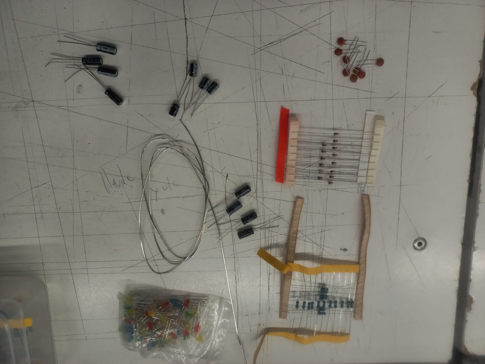
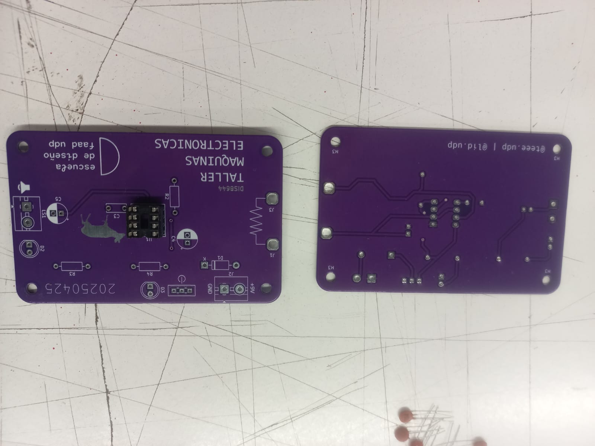
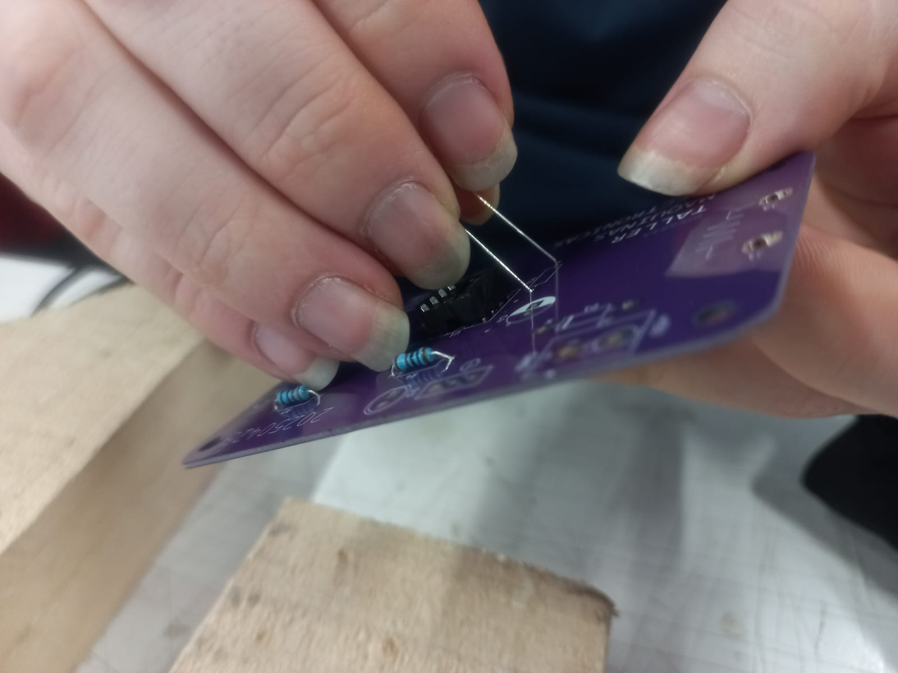
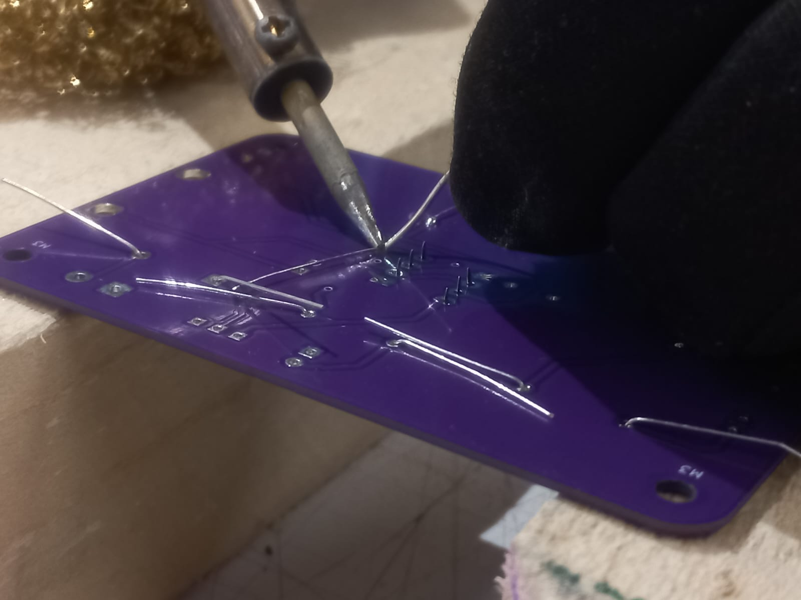
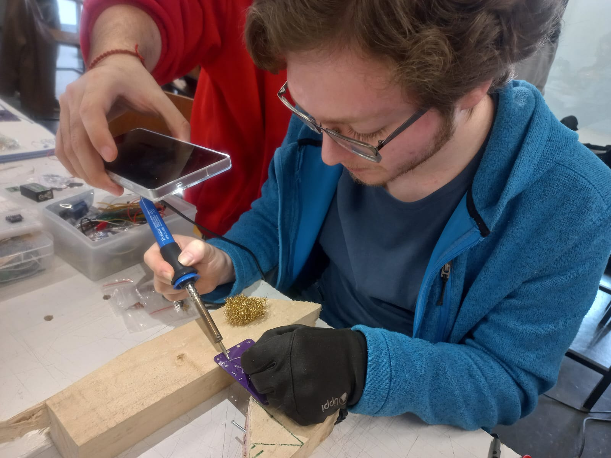
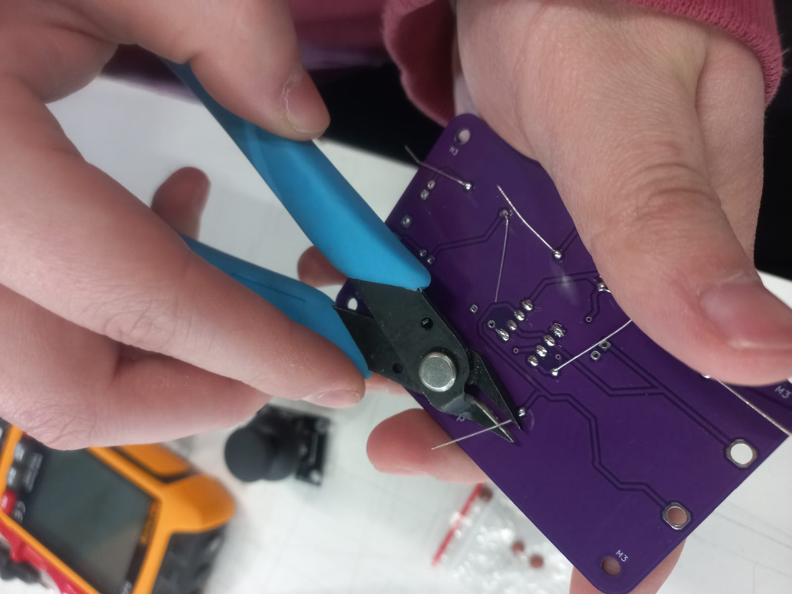
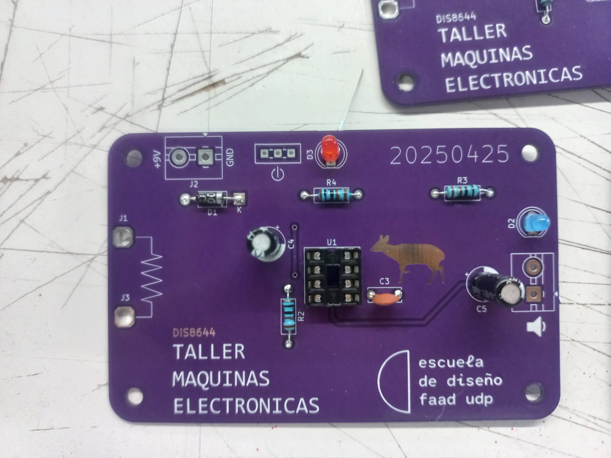
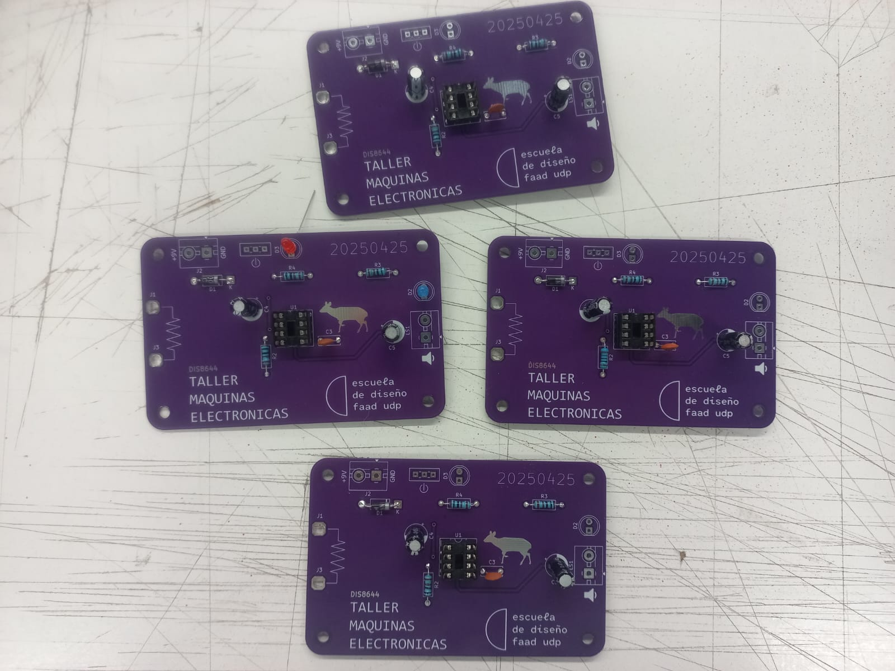
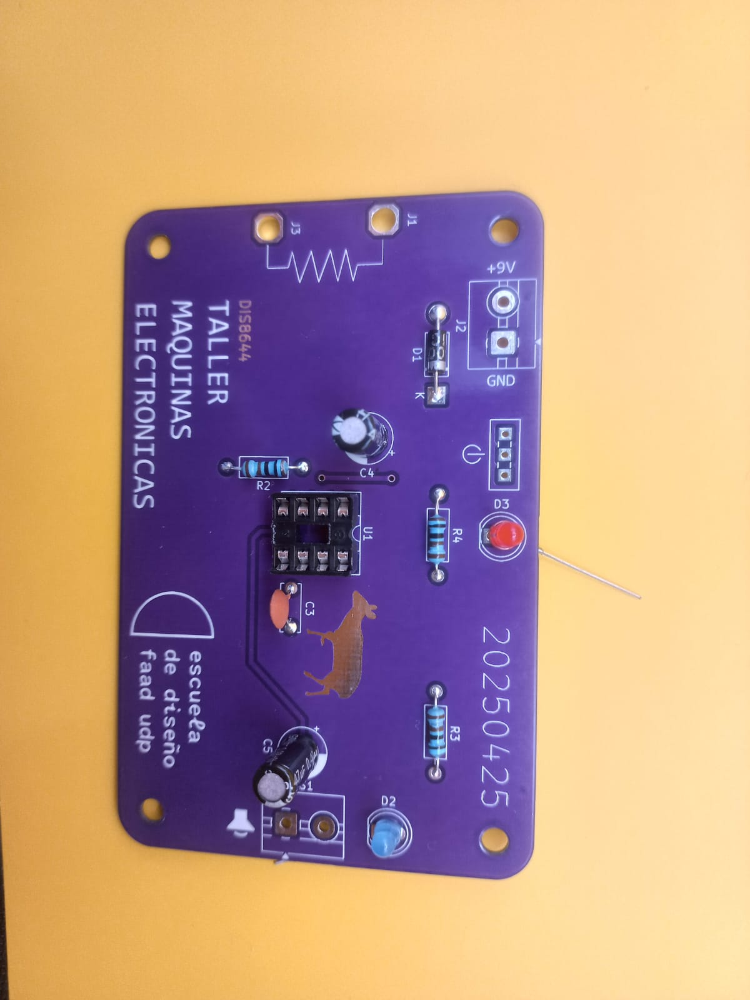

# sesion-10b

viernes 16 de mayo

llegué 12 minutos tarde

## primera parte

navegadores web

- cuando llegué a la sala estaban hablando sobre navegadores web, el primero fue chromium. Me llamó la atención porque una vez recuerdo que se me instaló solo chromium en el computador y salía que había reemplazado a google, pensé que era un virus, en realidad nunca supe si lo fue o no
- chromium es un navegador de fuente abierta, es la versión completa de google
- a percepción de aaron, safari no es un buen navegador porque colapsa siempre si se le piden muchas cosas
- internet explorer venía en la mayoría de los pc windows, duró 20 años y su sucesor fue microsoft edge
- microsoft edge depende de chrome
- hubo una colusión entre apple y google, cuando entrabas en apple se abría google
- firefox es el único navegador que no depende de google
- los principios de duck duck go son --- > protecion,privacy,peace of mind
- aaron cuando busca algo lo hace de la siguiente manera: !g , esto se usa para ir a google
- cuando ponemos signo de exclamación y el sitio al que queremos ir, nos dirige automáticamente, por ejemplo : !w (wikipedia) !yt (youtube)

### algunos datos

- la teoría del internet muerto explica que habrían mas robots que humanos en internet, por eso cada vez que entramos a algunos sitios nos preguntan si somos robots o humanos
- el sistema, enemigo, se maneja automáticamente
- en china no funciona tiktok, pese a que tiktok es chino, creemos que es por el tipo de contenido que se muestra en tiktok el gobierno chino no quiere que sus jóvenes consuman esto
- una vez en tiktok apareció una carta de bin laden explicando el motivo del ataque a las torres gemelas y se hizo viral

LLEGARON LAS PLACAS UDPUDU

- hermoso momento, muy bonitas las placas la verdad

## más apuntes

- nos mostraron el concepto de circuit bending
- es la customización de circuitos de dispositivos electrónicos
- se usan en juguetes de niños, los circuitos deben ser resistentes y simples
- nombraron a nicolas collins, hay un libro de el en el lab
- nicolas collins hace circuit bending, algunas perfomance nombradas: nicollas collins performs christian marclays, silicon luthier, the royal touch performance
- "agarrar un teclado, placa, meter los dedos al agua y te conviertes en la resistencia". Esto no entendí si literalmente hay que mojarse los dedos o es una forma de decir de meter mano en el circuito
- circuit but speak y spell
- hack of the mont club
- "el arte de la música electrónica hecha a mano" ---> un libro de Nicolas Collins, Aarón recomienda la segunda versión, del año 2009
- después de esto misaaaa procedió a hacer el BOM del udpudu en excel
- antes del break se organizó la sala en grupos de trabajo, movimos las mesas creando islas de trabajo

### post break

- después del break nos juntamos en grupos de 4 a 5 personas para comenzar a soldar los componentes de udpudu hecho en kicad ya directamente en la placa física
- acá no anoté muchas cosas porque en realidad estaba ocupado trabajando y viendo cómo avanzábamos, así que el paso a paso es ya parte del encargo y no de la bitácora.
- por último, trabajé con Francisco Stephens, Jose Morales y Martín Silva

### encargo 22: documentación textual del proceso de ensamblado de udpudu

a continuación se describirán los pasos a seguir para el montaje de ensamblado de udpudu

- el primer paso que se realizó fue reunirse en grupos de 4 personas para poder trabajar de manera más rápida y en equipos, la idea es que cada uno realizara una labor
- como grupo lo primero que hicimos fue revisar el BOM (bill of materials) de udpudu en github, de esta forma reunimos todos los componentes que necesitaban nuestras placas pcb
- reunimos la cantidad de componentes para que nos alcanzaran para todas las placas de nuestro grupo
- cada placa necesitaba utilizar:
- 1 socket de 8 pines
- 3 resistencias de 1k
- 1 diodo 1n4007
- 1 condensador cerámico 100n
- 1 condensador electrolítico 1u
- 1 consensador electrolítico 47u
- 2 LED 5mm
- 1 TBLOCK_2
- 1 speaker
- 1 switch spdt
- 1 chip NE555
- 1 clip batería
- 1 parlante 8ohm
- 2 cables caimán

después de reunir los materiales vamos con los siguientes pasos

- ya con nuestros materiales en mano debemos comenzar a soldar
- lo primero es calentar el cautín durante al menos 5 minutos, una vez acerquemos la mano y sintamos calor, está listo para ser utilizado
- en este caso el encargado de soldar fue Francisco Stephens ya que solo teníamos 1 cautín en nuestro grupo
- lo primero que soldamos fue el socket de 8 pines con el NE555 al centro de nuestra placa tal como nos indican nuestras guias realizadas en kicad
- el segundo paso fue soldar las 3 resistencias de 1k en sus respectivos lugares
- estos pasos los íbamos realizando en las 4 placas, es decir, se soldaba en la placa 1, luego en la 2, 3 y la 4
- mientras Francisco soldaba, José Morales se encargaba de documentar todo el proceso, yo me encargaba de cortar algunas piezas e iluminar a francisco con la linterna de mi celular mientras soldaba y por último Martín se encargaba de cortar los restos (patitas) de piezas que sobraban en las pcb
- el tercer paso fue soldar los diodos 1n4007 en cada una de las placas
- el cuarto y último paso que alcanzamos a realizar fue soldar los 2 LED de 5mm en cada una de las placas, por temas de tiempo no alcanzamos a soldar todos los componentes por lo cual no hay más proceso de ensamblaje, el viernes siguiente continuaremos y terminaremos las 4 placas
- es importante cuando se está ensamblando la pcb, que revisemos bien el lugar donde estamos poniendo los componentes y si los valores corresponden a los correctos para no equivocarnos y tener que desoldar los componentes
- al terminar de utilizar el cautín, lo desenchufamos y esperamos que se enfríe para guardarlo. También debemos limpiarlo con las virutillas doradas al terminar de usarlo para que no quede con residuos

### encargo 23 documentación visual del proceso de ensamblado de udpudu

1. reunimos los componentes

2. procedemos a ensamblarlos en los respectivos lugares antes de soldarlos

3. ahora comenzamos a soldar con mucho cuidado los componentes

4. mientras vamos teniendo algunas piezas soldadas, nos encargamos de retirar los restos de las patitas que sobran por la parte de atrás de nuestras placas

5. aquí tenemos una foto de una de las placas con lo que se alcanzó a soldar en clases, faltan componentes aún por soldar pero de momento queda así

6. por último una muestra del avance de las 4 placas, todas con los mismos componentes ya que fuimos 1 a 1

