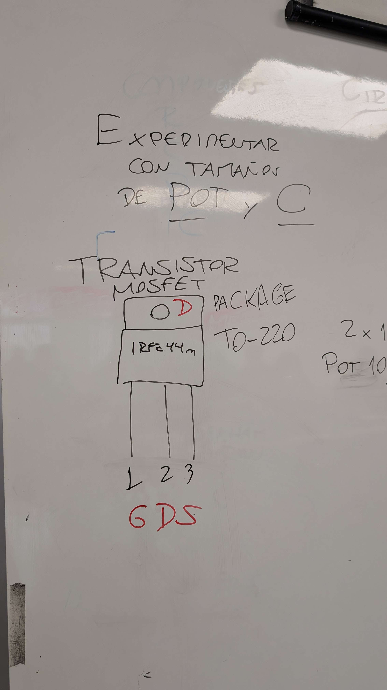
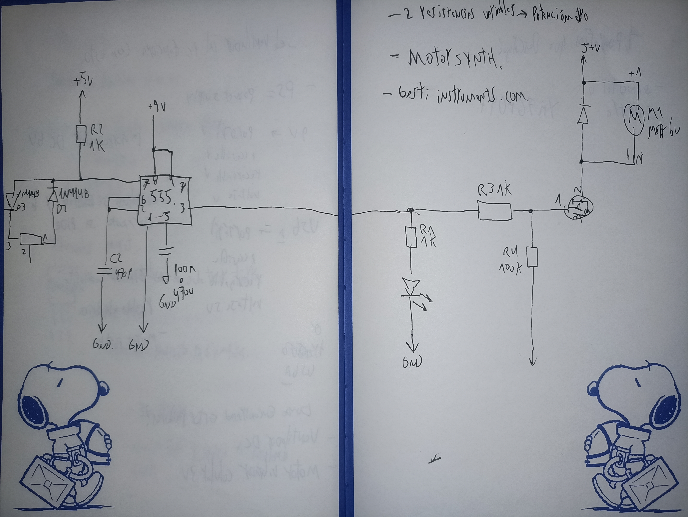

# sesion-11a

martes 20 de mayo de 2025

llegué tarde a clases por un taco horrible que había de la micro al metro, me perdí la primera media hora

## primera parte

- cuando llegué estaban hablando de que el proyecto 2 será un anteproyecto del examen, un pre-examen y que sería a mediados del mes de junio
- también en la pizarra estaban anotados algunos de los componentes que habíamos visto a modo de repaso, no alcancé a escribirlo todo porque lo borraron
- estaban anotados tambien los tipos de circuitos que hemos visto hasta el momento, de estos son los astable, monostable y ahora el pwm
- el día de hoy haremos un pwm pero le añadiremos un motor

en este rato armamos el pwm que habíamos armado la clase anterior, me funcionó mejor ahora que la vez pasada

aquí un video del circuito ya armado y funcionando

<https://github.com/user-attachments/assets/e639b94e-b67e-4c11-8b22-9a349fb0becb>

- una observación a comparación de la vez pasada, es que ya no parpadea cuando le bajamos al potenciómetro, la vez pasada si lo hacía y esto no tenía que ocurrir

- luego de armar el pwm misaaa explicó un poco sobre cómo íbamos a incorporar el motor en nuestro pwm
- el 555 se queda corto en amp (amperios) para alimentar al motor, esto es debido que las patas del 555 solo proveen 100 amp y el motor necesita 600 amp para funcionar
- los transistores reciben una pequeña señal que puede activar cosas más grandes, funciona como una especie de amplificador: pequeña señal abre la puerta
- GDS --- > gate source drain
- el transistor mofet tiene 3 patitas que se dividen en g d s, gate source drain, cada una de estas cumple una tarea distinta
- el transistor mofet tiene escrito irfz44n

### post break

- volvimos y comenzamos a trabajar en nuestro nuevo circuito que incluiría motor
- ps= power supply
- 9v--> portátil, accesible, recargable, voltaje sv
- usb a --> portátil, accesible, recargable, voltaje sv
- "el voltaje se entrega y la corriente se pide"
- zimoun, un artista que nos mostraron
- la regleta eléctrica
- moiret pattern
- ¿dónde podemos encontrar el motor que estamos utilizando?, en ventilador dc, en un motor vibrador celular 3v
- podemos hacer nuestro propio vibrador celular, no buscar en aliexpress por favor
- ahora haremos el circuito nuevo, aquí el esquemático

- en una primera instancia desarrollamos el circuito con un potenciómetro que nos permitía manipular el motor, adjunto video

<https://github.com/user-attachments/assets/a7666dc5-72bc-403d-b2b8-8207dcc418c2>

- este circuito a diferencia del pwm básico, contiene las modificaciones del transistor mofet
- después de hacer este circuito se agregó un pequeño hack, el cual consistía en cambiar el potenciómetro (resistencia variable) por un LDR
- lo que hace esto era que nos permite variar la velocidad del motor a medida que intervenimos en la luz que recibe el LDR, adjunto video

<https://github.com/user-attachments/assets/dd2b2f51-a45a-4cf1-baca-54ada48d1707>

- buenas noticias para el viernes, no hay encargo !!!!! yea
