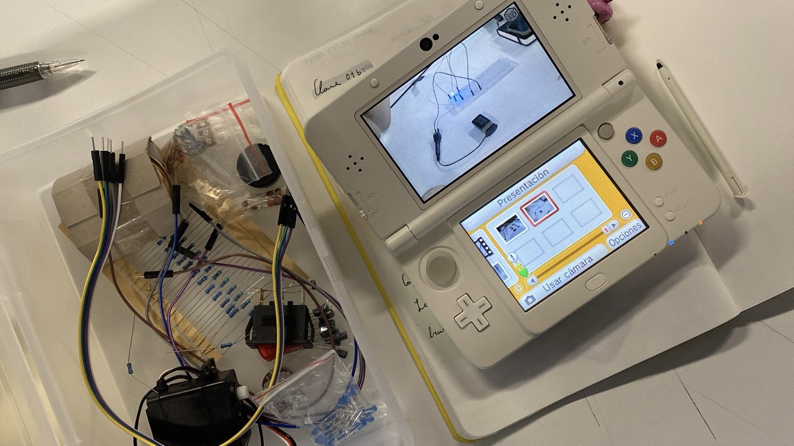
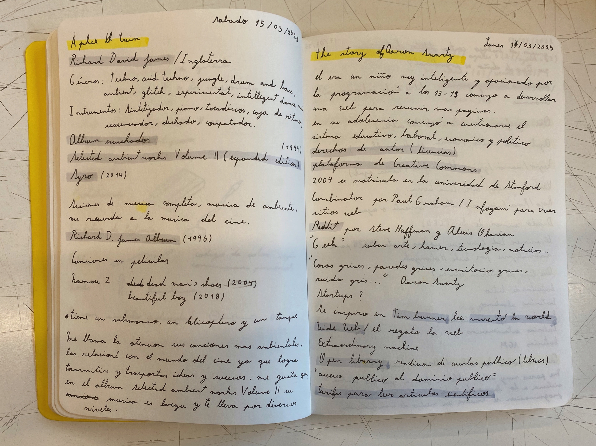
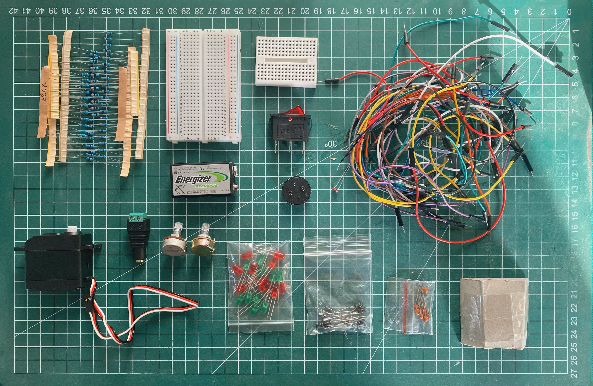
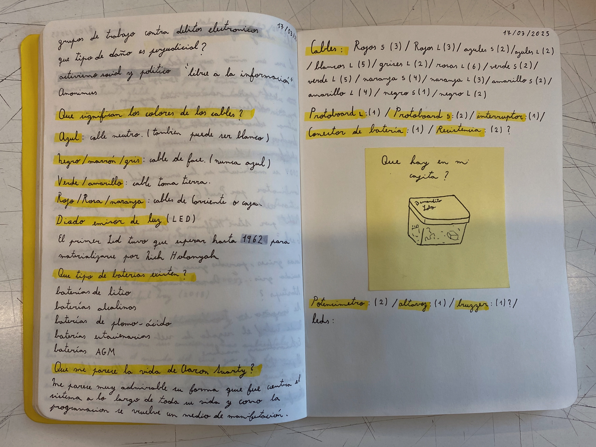

# sesion-01b

## Trabajo en clase / Viernes 14 de Marzo

### Componentes eléctricos y introducción a github

- Estudiamos los componentes que se encuentran en nuestras cajitas.
- Repaso de voltajes.
- Primer circuito eléctrico básico.
- Bases para escribir en GitHub.

## Encargos

### Encargo-02: Aplex Twin

- Álbum Selected Ambient Works Volume II Expanded Edition y Syro.
- Variedad de géneros como el techno, acid techno, jungle, ambient, glitch, experimental, entre otros.
- Sesiones de música completa, música ambiental.
- Transmiten ideas y sucesos; las canciones eran largas y te transportaban por diversos niveles.

### Encargo-02: Aaron Swartz

- Video documental "The Story of Aaron Swartz" <https://youtu.be/9vz06QO3UkQ?si=af0mqpFzA42sv1d8>
- Información adicional <https://www.infobae.com/historias/2025/01/11/un-hacker-convertido-en-martir-el-suicidio-del-prodigio-que-libero-el-conocimiento-restringido-de-la-web-y-fue-perseguido-por-el-fbi/?outputType=amp-type>
- Él era un niño muy inteligente y apasionado por la programación, a los 13 o 14 años comenzó a desarrollar una web para resumir las páginas.
- En su adolescencia comenzó a cuestionarse profundamente el sistema educativo, laboral, económico y político.
- Él participó y creó proyectos realmente importantes como RSS y Reddit, pero la vida laboral lo deprimía profundamente; decía que estaba rodeado de cosas grises, paredes grises, escritorios grises y ruido gris.
- Swartz estaba convencido de que el conocimiento, especialmente el que es producido con fondos públicos, como las investigaciones académicas, debía estar disponible para todos: "acceso público al dominio público", nada de tarifas para leer artículos científicos.
- En un computador conectado a la red, descargó cerca de 4 millones de artículos académicos de la base de datos JSTOR, una plataforma digital que almacena publicaciones científicas; su objetivo era liberarlos públicamente, aunque nunca llegó a publicarlos.
- Fue imputado por cometer fraude en línea y por once cargos bajo la "ley de fraude y abuso computacional" de los Estados Unidos.
- Le ofrecieron un acuerdo en el cual tenía que declararse culpable y cumplir seis meses en la cárcel. Él decidió rechazar este acuerdo, ya que consideraba que no había cometido ningún crimen. Lamentablemente, dos días después decidió quitarse la vida.
- Aaron Swartz fue un importante activista que lo único que buscaba era que todo el mundo tuviera acceso a la información académica.

### Encargo-03: Estudiar la caja de materiales inicial

- Reconocimiento de los componentes existentes.
- Inventario y organización de los componentes que se encuentran en mi cajita.
- Estudio del significado de los colores de los cables.

