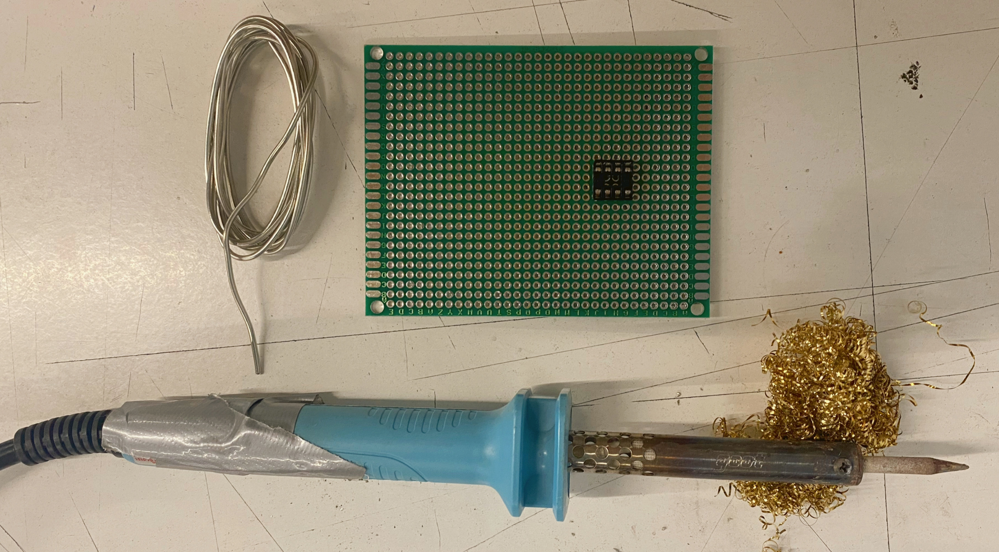

# sesion-05b

## Trabajo en clase / Viernes 11 de Abril

### Propuestas de modificaciones para el Atari punk console

- presentamos tres ideas con mi compañero 08-clifford1one
- la primera era un circuito que emitía una alarma cuando el otro estaba apagado, mostrando tal vez una idea con potencial conceptual.
- la segunda propuesta era una especie de ruleta un poco compleja de realizar.
- la tercera propuesta que fue finalmente la elegida, consiste en un circuito que emite una alarma cuando el LDR no detecta luz. esta idea tiene una carga más sensible  y puede resultar más práctica en su aplicación.

fuente <https://www.555-timer-circuits.com>

### Componentes para PCB y para panel

- componentes para PCB: son aquellos que se sueldan directamente en la placa electrónica y tienen terminales diseñadas para encajar en la PCB, como los pines.
- en los componentes para pcb tenemos dos tipos: tht (through hole technology), que es cuando los pines de los componentes atraviesan la placa a través de un agujero; y smd (surface mount technology), que es cuando los componentes se adhieren directamente a la superficie sin necesidad de perforaciones, esto permite fabricar placas más pequeñas.
- componentes para panel: van en la carcasa del producto, no en la PCB, se fijan con tornillos o tuercas y se conectan a la placa mediante cables.
- hay dos lados en un PCB: el top (que es donde están los componentes) y el bottom (donde se sueldan los componentes).
- para colocar chips en las PCBs o en un panel, hay que soldarle una base DIP, la cual es como una cajita en donde encaja el chip, por tanto se puede retirar cuando sea necesario sin dañar el componente con el calor.

### Mi primera soldadura

- aprendimos a soldar placas perforadas.
- primero se conecta el cautín y se deja calentar unos cinco minutos.
- limpia la punta con una bola de alambre o una esponja resistente al calor.
- inserta las patas del componente a través de los agujeros de la placa perforada.
- coloca la punta del cautín tocando al mismo tiempo la pata del componente y el agujero por tres segundos.
- acerca el estaño hasta que se derrita, retira el estaño y luego el cautín.

## Encargo

### Álbum "Kind of blue" por Miles Davis

- Fuente <https://www.chicagoacademyforthearts.org/heads-blog-2/2021/2/12/a-quick-intro-to-the-brilliance-of-miles-davis#:~:text=In%20addition%20to%20being%20widely,jazz%2C%20and%20%E2%80%9Cfusion%E2%80%9D>
- video "Leyendas: Miles Davis" <https://youtu.be/TRF5EOQDmpQ?si=xu0QRHl0VvkuqtDj>
- recomendación de Misa
- también escuché el álbum "birth of the cool"
- Miles Davis fue un trompetista y compositor, se le atribuye impulsar el cool jazz, el modal jazz y el jazz fusión.
- fue un hombre muy exitoso, increíblemente innovador y creativo, con una profunda sensibilidad y un fuerte compromiso como activista por los derechos raciales. sin embargo, también se dice que tuvo una fuerte adicción a las drogas y que fue un hombre misógino y agresivo en sus relaciones de pareja.
- nunca había escuchado un álbum de jazz y me encantó lo lento, transitorio y relajado que es el álbum.
- este "Blindfold test" de la revista Down Beat me pareció muy interesante <https://youtu.be/tZtSBz_6SSA?si=MgLMNVNjm5VXxtxe>

### Modificaciones APC Dark Detector

- decidimos seguir trabajando con el circuito detector de oscuridad.
- comenzamos traspasando el esquemático a la protoboard.
- hicimos un circuito en tinkercad para ordenar las ideas

