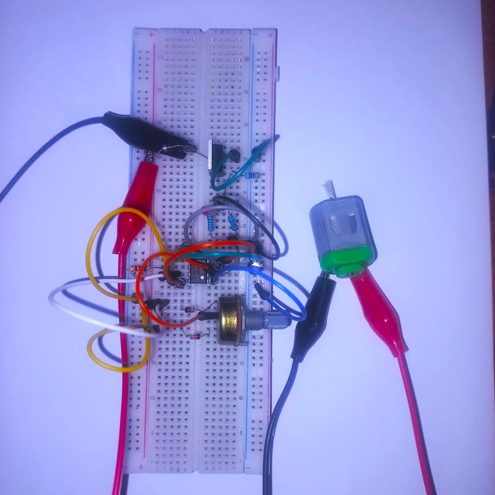
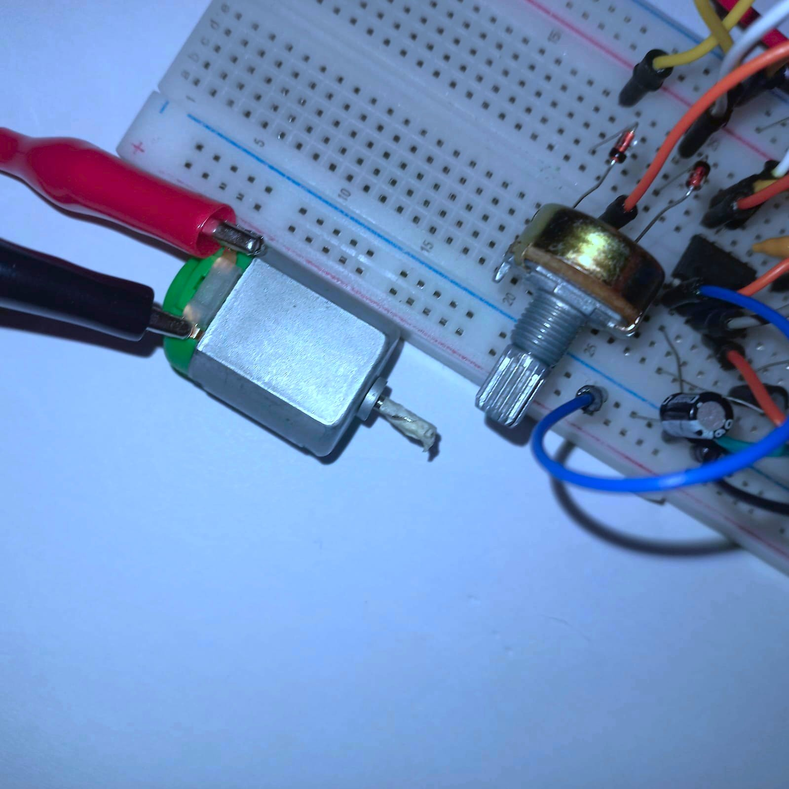

# sesion-11a

## Apuntes
- Vimos el transistor MOSFET, un componente que vamos a usar para amplificar señales. Nos explicaron que este transistor tiene tres patas: Gate, Drain y Source (GDS), y que funciona como una especie de interruptor inteligente: con una señal pequeña, permite que pase una corriente más grande.
  
- El 555 puede hacer PWM, pero no entrega suficiente corriente para un motor.
  
- PWM que es "Pulse Width Modulator", es un tipo de circuito que modula el ancho del pulso para controlar la potencia entregada.

- Un ejemplo de esto son los ventiladores de computadora, el PWM ajusta la velocidad.

- Nos recomendaron traer un cargador portátil y un cable USB tipo A que ya estuviera dañado, para cortarlo y usarlo como fuente de poder para trabajar.

- A la hora de armar el circuito, a varias personas del curso se les agotaba la batería muy rápido (incluyendome). Por eso, nos hablaron de diferentes fuentes de poder para evitar tener que usar la batería recargable de 9V. 

- Debido al bajo voltaje de la batería, el motor se encendía por un momento y luego se apagaba, mientras que el resto del circuito permanecía encendido.

## Encargo
- No hay encargos por semana de solemnes
