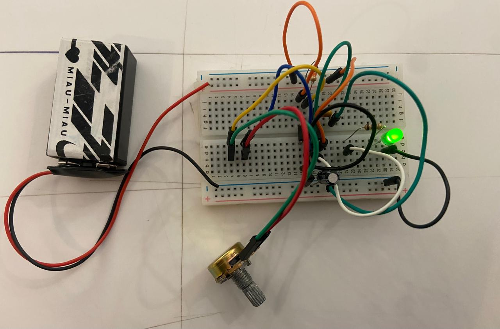
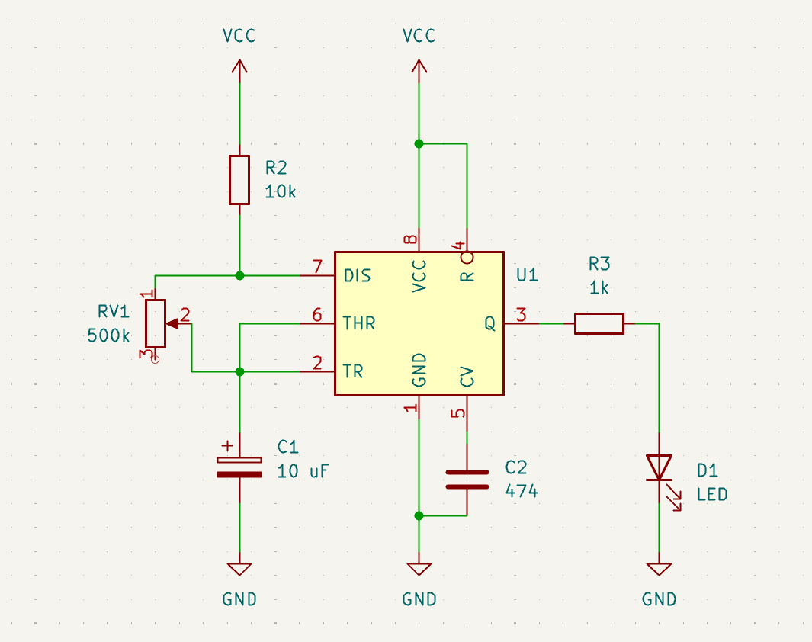
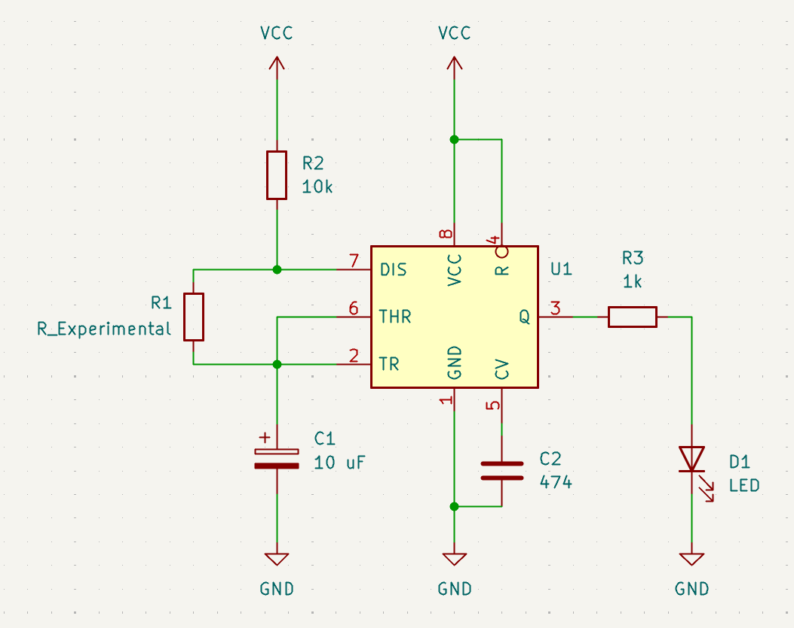
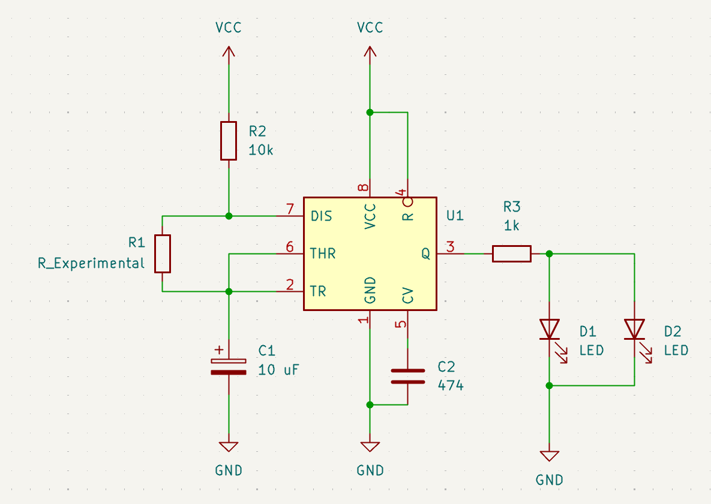

# ⋆₊˚⊹♡ Clase 03a - Conociendo el chip 555 ♡⊹˚₊⋆

Martes 25 Marzo 2025

***

## Registro visual de la bitácora y la clase

***

### Fotografías y videos

<https://github.com/user-attachments/assets/a851630b-5809-4e49-98fa-d26b09b296af>

### Encargo 06: ¿"Einstürzende neubauten" o "Stereolab"?

Para este encargo decidí elegir a la primera banda por su nombre, dado que al estar en alemán me genera más curiosidad.

A primeras lo que pude empezar a conocer de su banda es su origen: Berlín en 1980. Su música es catalogada como industrial y electrónica.
Las melodías son generadas a partir de instrumentos conocidos tales como guitarras, bajos y sintetizadores, además de otros tantos utencilios inventados y desarrollados por ellos mismos (muchas veces a partir de restos de materiales encontrados en la basura). Esto les permite el poder ir desarrollando su música a través de la improvisación, alzando el mensaje ["Hay que destruir para poder construir"](https://www.lanacion.com.ar/espectaculos/musica/einsturzende-neubauten-destruir-crear-secreto-banda-mejor-nid2376555/).

▼ Captura de fotograma del video "Einstürzende Neubauten - Slideshow of EN Instruments (no sound)". 
Recuperado de: https://youtu.be/-k1p4IxxNwo?si=ARQQ2buOEabj3W57.

Para este análisis escogí el álbum "Halber Mensch", de 1985. Este es la tercera publicación por "What's So Funny About GmbH" en Alemania.
En la página oficial del grupo se puede encontrar la [lista de letras](https://neubauten.org/en/halber-mensch/) de cada canción presente en este disco.

▼ Portada del disco Halber Mensch. Recuperado de: https://www.discogs.com/es/release/502732-Einst%C3%BCrzende-Neubauten-Halber-Mensch.

Al escuchar el disco me despertaron muchas emociones, entre de gusto y disgusto. En el comienzo, me gustó la composición improvisada de "instrumentos" que se presenta en cada canción, generando una gran gama de sonidos a coordinar. Ello me dejó cuestionando sobre los orígenes de la música, pensando en ¿Qué es como tal?, ¿Debe poseer un ritmo?, ¿Es necesario que sea generada por tocar un "instrumento"?. Esta mezcla de sonidos fue agradable, armoniosa para mis oídos, sensación que duró poco puesto que se hizo presente. Poco a poco, las letras y entonaciones de quienes cantan me fueron cambiando mi estado de ánimo, recordándome tiempos oscuros relacionados a la religión, pues me daba sensación de estar presente en una especie de misa en la cuál se emitía un juicio. Pese a ello decidí seguir disfrutando dentro de lo posible la música, pese a la incomodidad.

***

### Encargo 07: Expansión sobre el Chip 555

En esta clase se realizó un circuito, el cual funciona mediante el chip 555. 

Pude encontrar el [datasheet del circuito integrado](./archivos/NA555.pdf)

Al montar los componentes en los distintos canales de salida del Chip, teniendo como "resistencia variable" un resistor de 10K, pues permite que la energía que circula envíe una señal que se vea cortada por el paso de corriente de esta, actuando y generando intervalos en los que la luz se enciende y se apaga de forma uniforme. (0 y 1, Si y No, etc). 

▼ Imagen de los pines del Chip 555. Recuperado de: https://electrotec.pe/blog/ElectronicaBasica.

Al modificarse el valor de la resistencia colocada al lado del led, la cantidad de luz emitida por este puede ser más o menos brillante dependiendo de si el valor es alto o bajo.

En este caso, el condensador polarizado de 10uF "guarda" energía por un corto periodo de tiempo antes de que toque el lado negativo, lo que se traduce en el tiempo que pasa encendido y apagado el led. Por otra parte, el otro condensador cerámico "474" permite el paso de corriente de forma directa a tierra.

<https://github.com/user-attachments/assets/b41a8ed5-593c-43e3-8686-41cc19787fea>

▼ Circuito practicado en clase.

<https://github.com/user-attachments/assets/d48ab110-e728-408c-a3f8-11afb6facce3>

▼ Circuito practicado en clase, con el condensador polarizado modificado (de 10uF a 100uF)

▼ Diagrama del circuito.

#### BOM (Bill Of Materials) 1

| Componente       | Qty | Nombre(s) | Valor/tipo |
|-----------------------|---------|------------|----------------|
| Batería               | 1       | BT1      |       9V       |
| Resistencias          | 3       | R1, R2, R3     | 1k, 10k  |
| Leds                  | 1      |  D1  |   3,3V    |
| Chip 555                  | 1      |  U1  |   4.5V a 16V  |
| Condensador polarizado                  | 1      |  C1  |   10uF  |
| Condensador Cerámico 474                 | 1      |  C2  |   0.47uF |

***

Más tarde, el 27 de marzo, se rearmó el circuito pero usando como resustencia variable un potenciometro de 500k.

<https://github.com/user-attachments/assets/b9e250f6-0250-47a1-93ce-46c661f28116>

▼ Fotografía y video del circuito en uso.

▼ Diagrama del circuito.

#### BOM (Bill Of Materials) 2

| Componente       | Qty | Nombre(s) | Valor/tipo |
|-----------------------|---------|------------|----------------|
| Batería               | 1       | BT1      |       9V       |
| Resistencias          | 2       | R1, R2    | 1k, 10k  |
| Leds                  | 1      |  D1  |   3,3V    |
| Chip 555                  | 1      |  U1  |   4.5V a 16V  |
| Condensador polarizado                  | 1      |  C1  |   10uF  |
| Condensador Cerámico 474                 | 1      |  C2  |   0.47uF |
| Potenciometro             | 1      |  RV1  |   500k |

***

Además de este experimento, el mismo día fui probando nuevos cambios en el circuito, esta vez usando caimanes para conectarlos a distintos materiales y trabajar con "resistencias variables".

<https://github.com/user-attachments/assets/6779ab7c-c8de-4b74-97f9-edc41ddc20fd>

<https://github.com/user-attachments/assets/cb866195-6aaf-405d-b63b-fe79d98807c4>

<https://github.com/user-attachments/assets/61e20b3a-0649-4b57-a16d-e372182abc73>

▼ Videos del circuito en función. En el primero se utilizó como resistencia variable un papel mojado, lo que trasmite de forma más directa la corriente y hace que la luz parpadee más rápido. En el video 2 y 3 se puede apreciar el uso de manos (mías y de mi jefa) para hacer de “puente” y encender la luz.

▼ Diagrama del circuito.

#### BOM (Bill Of Materials) 3

| Componente       | Qty | Nombre(s) | Valor/tipo |
|-----------------------|---------|------------|----------------|
| Batería               | 1       | BT1      |       9V       |
| Resistencias          | 2       | R1, R2    | 1k, 10k  |
| Resistencias variable          | 1       | R1   | Variable  |
| Leds                  | 1      |  D1  |   3,3V    |
| Chip 555                  | 1      |  U1  |   4.5V a 16V  |
| Condensador polarizado                  | 1      |  C1  |   10uF  |
| Condensador Cerámico 474                 | 1      |  C2  |   0.47uF |

***

Cómo último experimento del día, llegué a mi casa tras el trabajo para probar a conectar una papa como resistencia variable, además de incluir un led de color rojo al circuito y hacerlo funcionar.

<https://github.com/user-attachments/assets/10e91909-ab8b-411c-a5ab-eb24b690c73f>

▼ Video del circuito en función.

▼ Diagrama del circuito.

#### BOM (Bill Of Materials) 4

| Componente       | Qty | Nombre(s) | Valor/tipo |
|-----------------------|---------|------------|----------------|
| Batería               | 1       | BT1      |       9V       |
| Resistencias          | 2       | R2, R3    | 1k, 10k  |
| Resistencias variable          | 1       | R1   | Variable  |
| Leds                  | 2      |  D1, D2  |   3,3V    |
| Chip 555                  | 1      |  U1  |   4.5V a 16V  |
| Condensador polarizado                  | 1      |  C1  |   10uF  |
| Condensador Cerámico 474                 | 1      |  C2  |   0.47uF |

Lo que más me gusto de estos experimentos fue el volver a disfrutar y jugar como niña, el poder compartir con quienes trabajé ese día e ir viendo cómo con pequeños ajustes el Chip 555 podía dar otros resultados.

***

### Posdata

Voy rehaciendo todo poco a poco... aunque cueste ( ͡❛ ㅅ ͡❛)

***

°˖✧◝(⁰▿⁰)◜✧˖°
