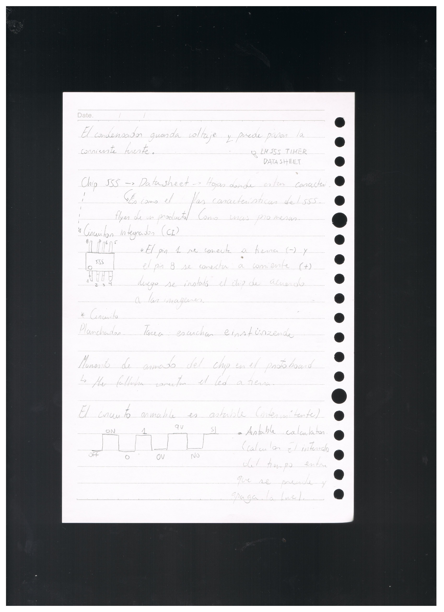
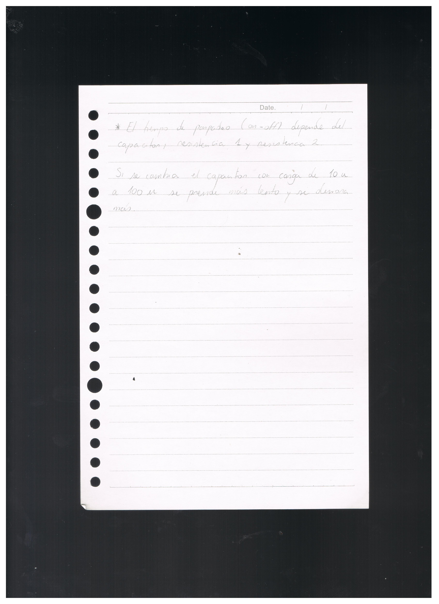

# ⋆₊˚⊹♡ Clase 03a - Conociendo el chip 555 ♡⊹˚₊⋆

Martes 25/03/2024

***

## Registro visual de la bitácora y la clase

***

### Fotografías y videos

<https://github.com/user-attachments/assets/a851630b-5809-4e49-98fa-d26b09b296af>

### Encargo 06: ¿"Einstürzende neubauten" o "Stereolab"?

Para este encargo decidí elegir a la primera banda por su nombre, dado que al estar en alemán me genera más curiosidad.

A primeras lo que pude empezar a conocer de su banda es su origen: Berlín en 1980. Su música es catalogada como industrial y electrónica.
Los instrumentos y sonidos con los que realizaron sus composiciones fueron inventados y desarrollados por estos mismos.

***

### Encargo 07: Expansión sobre el Chip 555

En esta clase se realizó un circuito, el cual funciona mediante el chip 555. Al montar los componentes en los distintos canales de salida del Chip, teniendo como "resistencia variable" un resistor de 10K, pues permite que la energía que circula envíe una señal que se vea cortada por el paso de corriente de esta, actuando y generando intervalos en los que la luz se enciende y se apaga de forma uniforme. Si llegara a modificarse el valor de la resistencia los intervalos podrían ser más cortos (si traspasa más energía) o más largos (si la limita). Es importante definir los valores de las piezas que lo rodean, cómo es el caso de los condensadores cerámicos (polarizados o no). En este caso. el condensador polarizado de 10uF "guarda" energía por un corto periodo de tiempo antes de que toque el lado negativo. Por otra parte, el otro condensador cerámico "474" permite el paso de corriente de forma directa a tierra.

***

### Posdata

Voy rehaciedo todo poco a poco... aunque cueste ( ͡❛ ㅅ ͡❛)

***

°˖✧◝(⁰▿⁰)◜✧˖°
