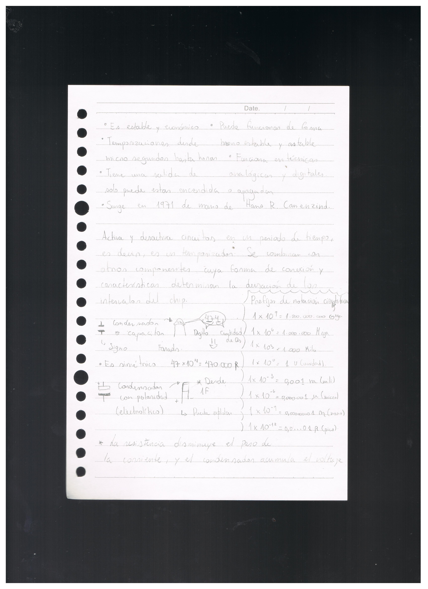
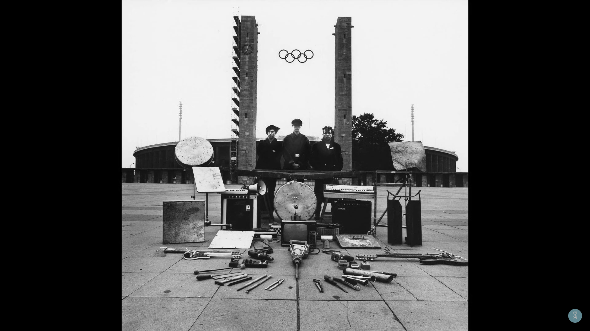
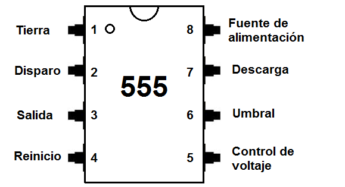
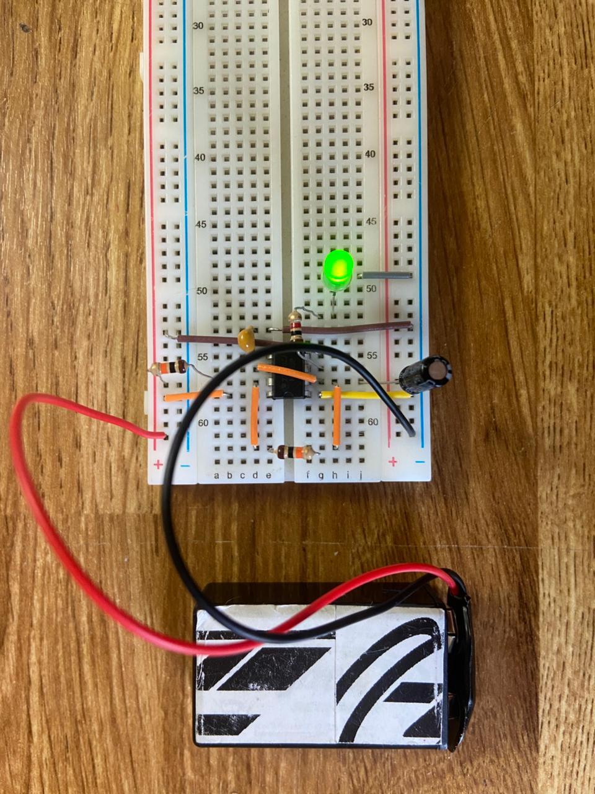
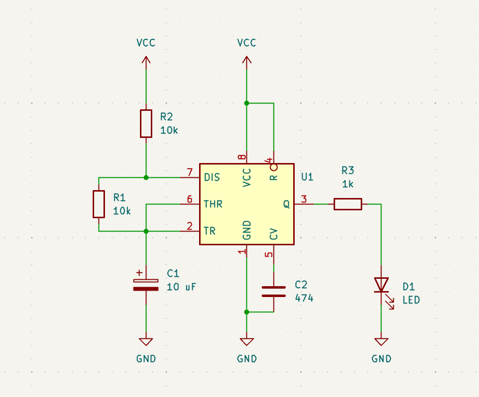

# ⋆₊˚⊹♡ Clase 03a - Conociendo el chip 555 ♡⊹˚₊⋆

Martes 25/03/2024

***

## Registro visual de la bitácora y la clase

***

### Fotografías y videos

<https://github.com/user-attachments/assets/a851630b-5809-4e49-98fa-d26b09b296af>

### Encargo 06: ¿"Einstürzende neubauten" o "Stereolab"?

Para este encargo decidí elegir a la primera banda por su nombre, dado que al estar en alemán me genera más curiosidad.

A primeras lo que pude empezar a conocer de su banda es su origen: Berlín en 1980. Su música es catalogada como industrial y electrónica.
Las melodías son generadas a partir de instrumentos conocidos tales como guitarras, bajos y sintetizadores, además de otros tantos utencilios inventados y desarrollados por ellos mismos (muchas veces a partir de restos de materiales encontrados en la basura). Esto les permite el poder ir desarrollando su música a través de la improvisación, alzando el mensaje ["Hay que destruir para poder construir"](https://www.lanacion.com.ar/espectaculos/musica/einsturzende-neubauten-destruir-crear-secreto-banda-mejor-nid2376555/).

▼ Captura de fotograma del video "Einstürzende Neubauten - Slideshow of EN Instruments (no sound)". 
Recuperado de: https://youtu.be/-k1p4IxxNwo?si=ARQQ2buOEabj3W57.

Para este análisis escogí el álbum "Halber Mensch", de 1985. Este es la tercera publicación por "What's So Funny About GmbH" en Alemania.
En la página oficial del grupo se puede encontrar la [lista de letras](https://neubauten.org/en/halber-mensch/) de cada canción presente en este disco.

▼ Portada del disco Halber Mensch. Recuperado de: https://www.discogs.com/es/release/502732-Einst%C3%BCrzende-Neubauten-Halber-Mensch.

***

### Encargo 07: Expansión sobre el Chip 555

En esta clase se realizó un circuito, el cual funciona mediante el chip 555. 

Al montar los componentes en los distintos canales de salida del Chip, teniendo como "resistencia variable" un resistor de 10K, pues permite que la energía que circula envíe una señal que se vea cortada por el paso de corriente de esta, actuando y generando intervalos en los que la luz se enciende y se apaga de forma uniforme. (0 y 1, Si y No, etc). 

▼ Imagen de los pines del Chip 555. Recuperado de: https://electrotec.pe/blog/ElectronicaBasica.

Al modificarse el valor de la resistencia colocada al lado del led, la cantidad de luz emitida por este puede ser más o menos brillante dependiendo de si el valor es alto o bajo.

En este caso, el condensador polarizado de 10uF "guarda" energía por un corto periodo de tiempo antes de que toque el lado negativo, lo que se traduce en el tiempo que pasa encendido y apagado el led. Por otra parte, el otro condensador cerámico "474" permite el paso de corriente de forma directa a tierra.

<https://github.com/user-attachments/assets/b41a8ed5-593c-43e3-8686-41cc19787fea>

▼ Circuito practicado en clase.

<https://github.com/user-attachments/assets/d48ab110-e728-408c-a3f8-11afb6facce3>

▼ Circuito practicado en clase, con el condensador polarizado modificado (de 10uF a 100uF)

▼ Diagrama del circuito.

#### BOM (Bill Of Materials) 1

| Componente       | Qty | Nombre(s) | Valor/tipo |
|-----------------------|---------|------------|----------------|
| Batería               | 1       | BT1      |       9V       |
| Resistencias          | 3       | R1, R2, R3     | 1k, 10k  |
| Leds                  | 1      |  D1  |   3,3V    |
| Chip 555                  | 1      |  U1  |   4.5V a 16V  |
| Condensador polarizado                  | 1      |  C1  |   10uF  |
| Condensador Cerámico 474                 | 1      |  C2  |   0.47uF |

***

Más tarde, el 27 de marzo, se rearmó el circuito pero usando como resustencia variable un potenciometro de 500k.

<https://github.com/user-attachments/assets/b9e250f6-0250-47a1-93ce-46c661f28116>

▼ Fotografía del circuito y video en uso.

▼ Diagrama del circuito.

#### BOM (Bill Of Materials) 2

| Componente       | Qty | Nombre(s) | Valor/tipo |
|-----------------------|---------|------------|----------------|
| Batería               | 1       | BT1      |       9V       |
| Resistencias          | 3       | R1, R2    | 1k, 10k  |
| Leds                  | 1      |  D1  |   3,3V    |
| Chip 555                  | 1      |  U1  |   4.5V a 16V  |
| Condensador polarizado                  | 1      |  C1  |   10uF  |
| Condensador Cerámico 474                 | 1      |  C2  |   0.47uF |
| Potenciometro             | 1      |  RV1  |   500k |

***

### Posdata

Voy rehaciendo todo poco a poco... aunque cueste ( ͡❛ ㅅ ͡❛)

***

°˖✧◝(⁰▿⁰)◜✧˖°
