# ⋆₊˚⊹♡ Clase 04b - Segundos avances ♡⊹˚₊⋆

Viernes 4 de Abril del 2025

***

## Observaciones

Al comienzo de la clase se trató de poder analizar y revisar los primeros objetos traídos por algunos alumnos para poder hablar de estos y comprender la estructura de su carcasa y el circuito, además de poder teorizar sobre su posible funcionalidad (en el caso de un control de juguete). Pudimos hablar y revisar distintos sintetizadores, revisando cómo era cada producto junto con sus características. De todos los que vimos, sólo 1 fue puesto a prueba: El sintetizador Grandmother de la compañía Moog. Tras poder experimentar con este durante el recreo comenzó la etapa para rearmar circuítos, volviendo a revisar y rehacer el circuito del Atari Punk Console.

***

### Escaneo de bitácora y apuntes escritos del día

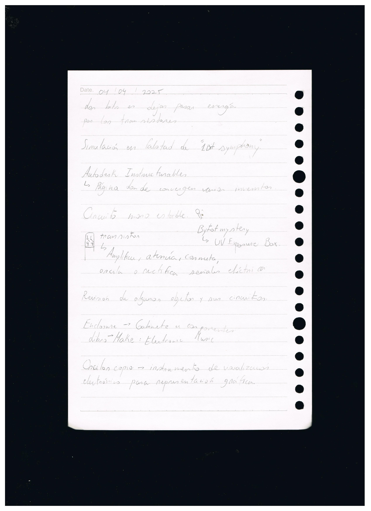

***

### Encargo 10: Wendy Carlos - Switched on bach

Este es el álbum debut de Wendy Carlos, una compositora e interprete de música electrónica oriunda de estados unidos. Su fama se debe a ser una de las primeras artistas en trabajar con sintetizadores para producir música, popularizando dicho género a nuevos públicos.
El disco en cuestión fue publicado en 1968 por la productora “Columbia Records”. Para poder componer las canciones se utilizó un [sintetizador Moog]( https://en.wikipedia.org/wiki/Moog_synthesizer) para reemplazar los tonos de una orquesta, pieza la cuál posee módulos separados que permiten crear y dar una forma a los sonidos mediante cables de corriente. Este instrumento fue desarrollado por Robert Moog en colaboración con Wendy. Entre las múltiples piezas eléctricas que poseen se destacan los osciladores, amplificadores, filtros, generadores de ruido, mezcladores, entre otros. Por otra parte, este instrumento se puede controlar mediante pedales, teclas, perillas, controladores de cinta, botones, etc. Tras la alta demanda de este tipo de productos, la compañía “Moog” respondió más tarde desarrollando equipos de electrónica más accesibles y sencillos de usar, innovando al poder permitir controlar el tono mediante el voltaje.
Regresando a la música, desde 1970 el álbum posee los premios Grammy al mejor álbum clásico, la mejor reinterpretación musical y la mejor ingeniería de grabación clásica.
Más tarde, en 1986 fue reconocido como el segundo álbum clásico en ser certificado como platino, vendiendo más de 1 millón de copias para la fecha.

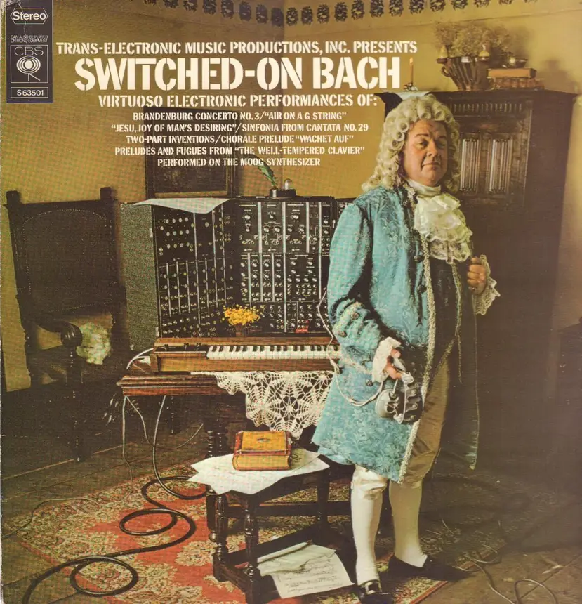

▼ Portada del disco. Recuperado de: https://recordsale.de/de/kuenstler/wendy-carlos/albums/switched-on-bach

En lo personal me gustó bastante este álbum. De cierta forma me trae recuerdos de mi infancia al escuchar la música o sonidos que emitían algunas consolas de juegos. Los ritmos los percibo como relajantes, armoniosos y tranquilos, lo que ha sido un apoyo al momento de trabajar en estos documentos e investigación.

***

### Encargo 11: Bajando la opacidad de la caja - Investigación a profundidad de un nuevo objeto

Dada la complejidad del uso de pantallas para un proyecto, puesto que son "inputs" dificiles de controlar y que requieren de programación y conocimientos que no se verán en el semestre, comencé con la búsqueda de un segundo juguete electrónico que requiera de corriente o pilas para poder funcionar. Para ello se me ocurrió comprar un producto que ví cuando trabajé en una tienda de productos para el hogar y de uso personal, el cuál afortunadamente encontré: un dron de juguete con un sensor de proximidad.

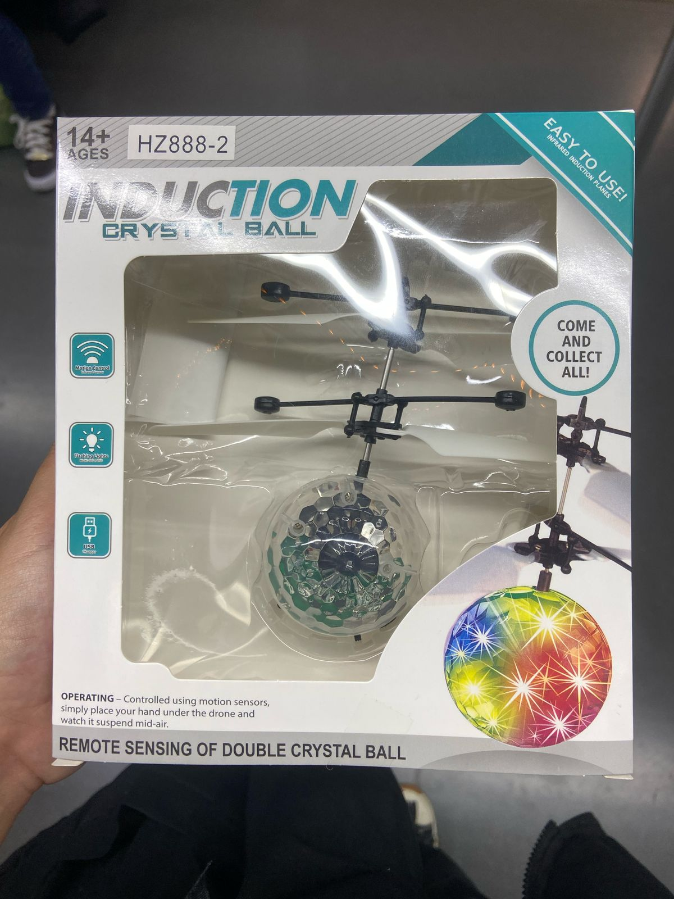

▼ Empaque y producto por delante

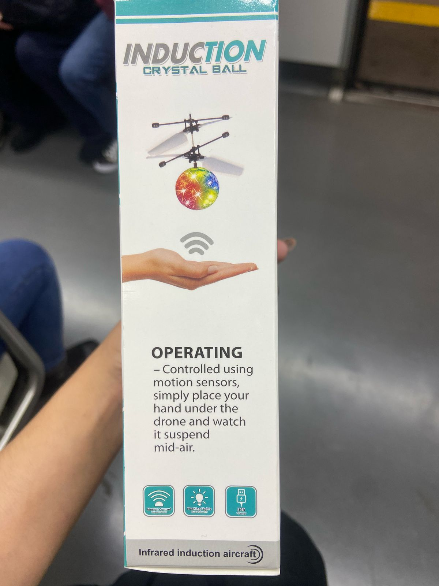

▼ Empaque y producto por el lado

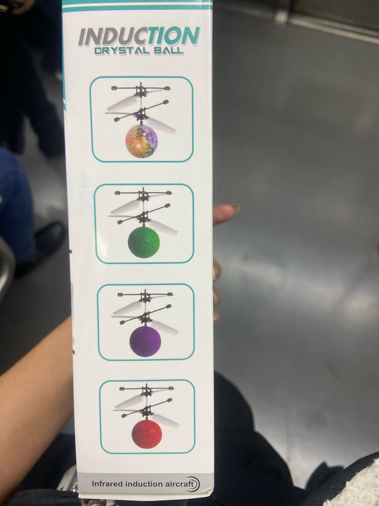

▼ Empaque y producto por el otro lado

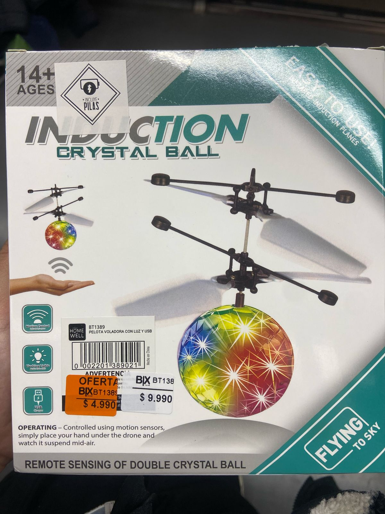

▼ Empaque y producto por detrás

El empaque es de cartón impreso con una lámina transparente que permite ver al juguete (estructura y forma, materiales, colores, tamaño entre otros) en conjunto con el cable de carga que viene incorporado. Por dentro posee un débil "molde" de plástico que protege al producto de golpes leves. Este objeto no incluye manual de instrucciones, dado que la caja que lo contiene detalla el uso del objeto y las variantes existentes del don (pelotas de múltiples colores y diseños). La información que posee el paquete (todo en inglés) habla de la marca que lo importa (marca homewell y vendido en BIX), el nombre del producto "INDUCTION: Crystal ball", la edad recomendada de uso (para más de 14 años), los mensajes "Easy to use! Infrared induction planes"(¡Fácil de usar! Aviones de inducción infrarroja) y "Come and collect all!"(¡Ven y coleccionalo todo!), información sobre el uso y unos signos con texto que hablan del funcionamiento, como que este dispositivo es recargable usando un cable USB, que funciona con un sensor infrarrojo y que tiene luces brillantes.

Al costado del paquete se muestran las versiones de dicho juguete mediante imágenes, mientras que al lado opuesto se repite la información del frente del producto. En la parte trasera de la caja vuelve a repetirse la información, a excepción de los códigos del producto y de un sticker que menciona que trae pilas.

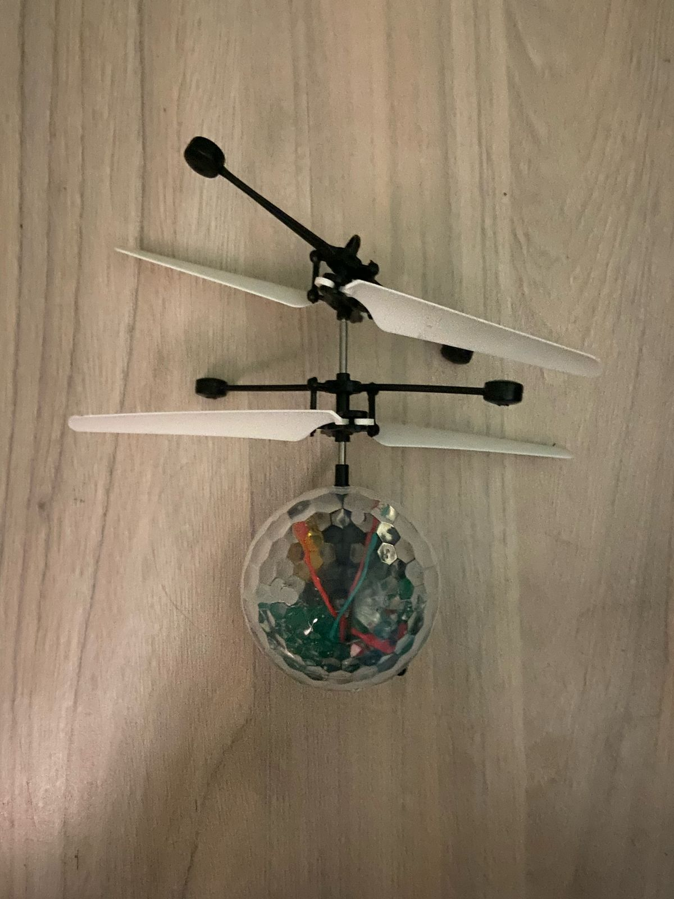

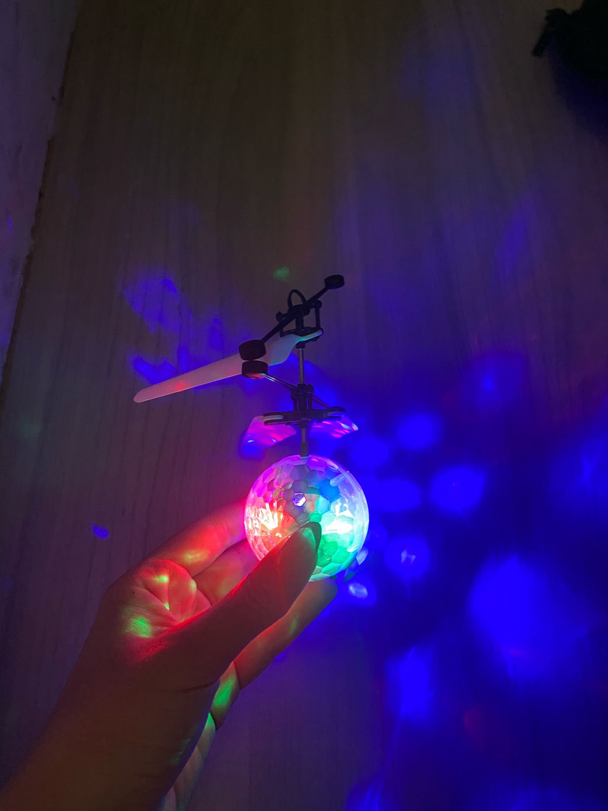

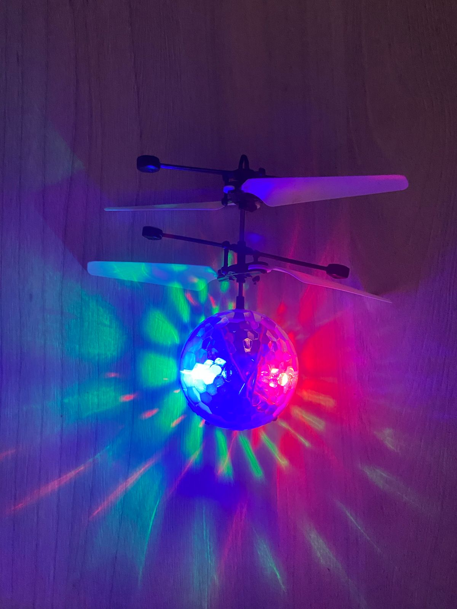

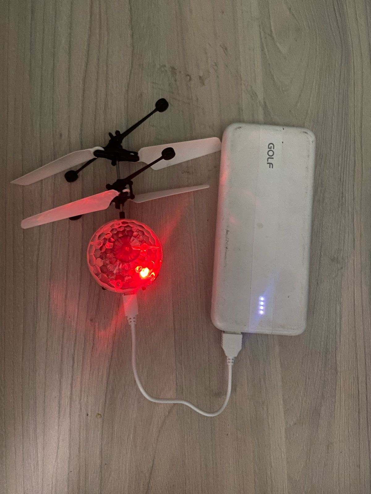

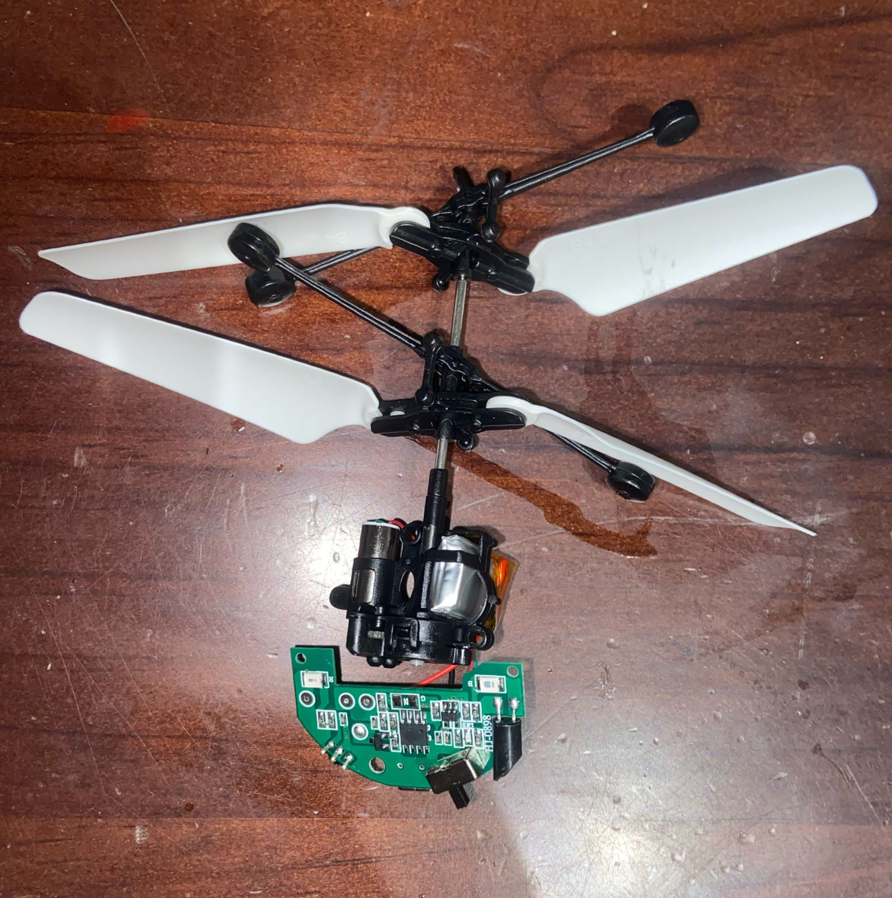

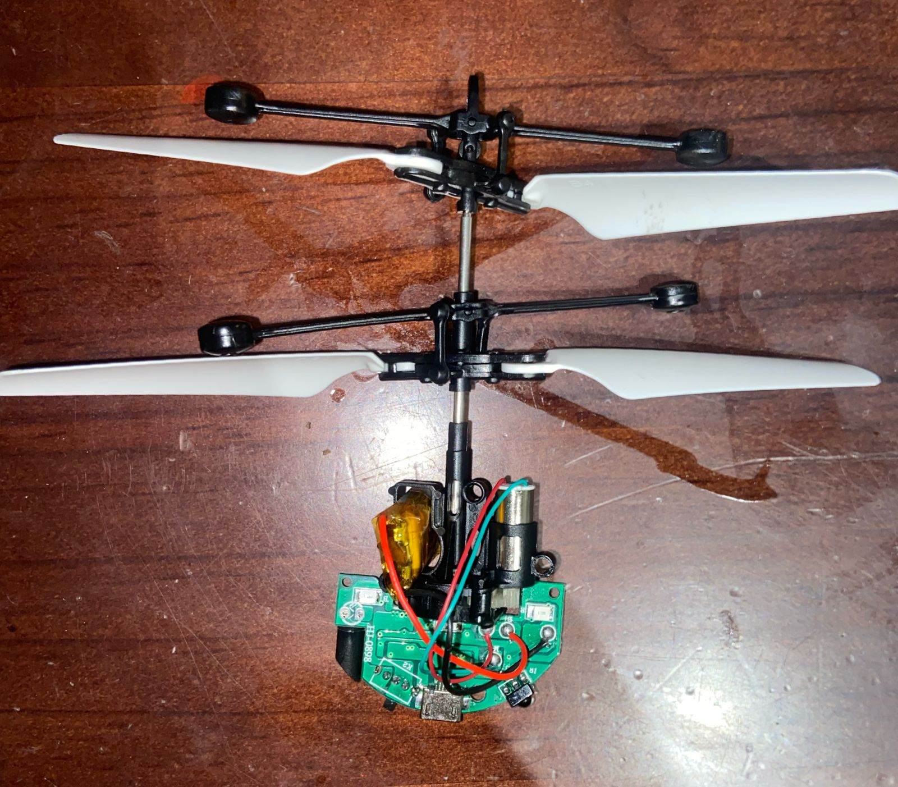

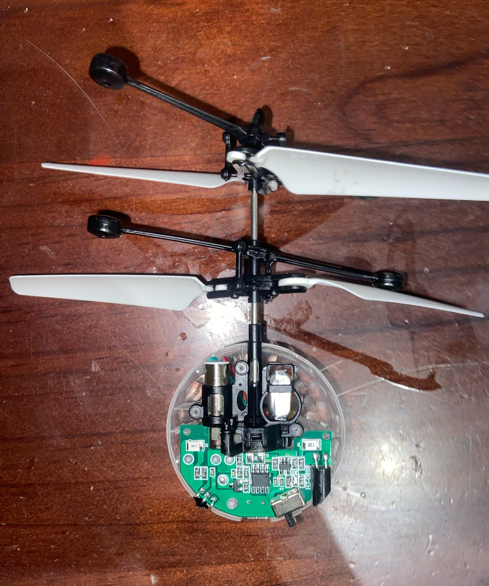

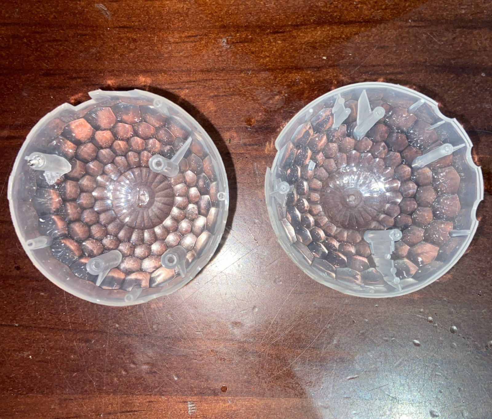

▼ Página original de la tienda en la que compré el producto.

- Link: <https://bix.cl/products/pelota-voladora-con-luz-y-usb?variant=48257994064152>

***

### Investigación

Como primera búsqueda y consultando directamente con el nombre de "dron con luz" pude indagar y ver que este producto lleva cerca de 8 u más años en el mercado, encontrando páginas web como Temu que también venden el artículo y poseen más información complementaria sobre el objeto.

- Link: <https://share.temu.com/6X3VJrisvnA>

Además, pude encontrar un video en Youtube por la mano de unos creadores de contenido muy conocidos "Experimentos caseros", el cuál habla sobre el producto y lo ponen a prueba.

- Link: <https://youtu.be/QwVMbZH8AtY?si=SIBjLOZ4M9sh5gxf>

Todavía es necesario seguir indagando para descubrir la naturaleza del funcionamiento de sus piezas vitales: el circuito, la batería, el motor, el sensor infrarojo.

### Posdata

Estoy cansada...me cuesta descansar ૮◞ ﻌ ◟ა

***

°˖✧◝(⁰▿⁰)◜✧˖°
