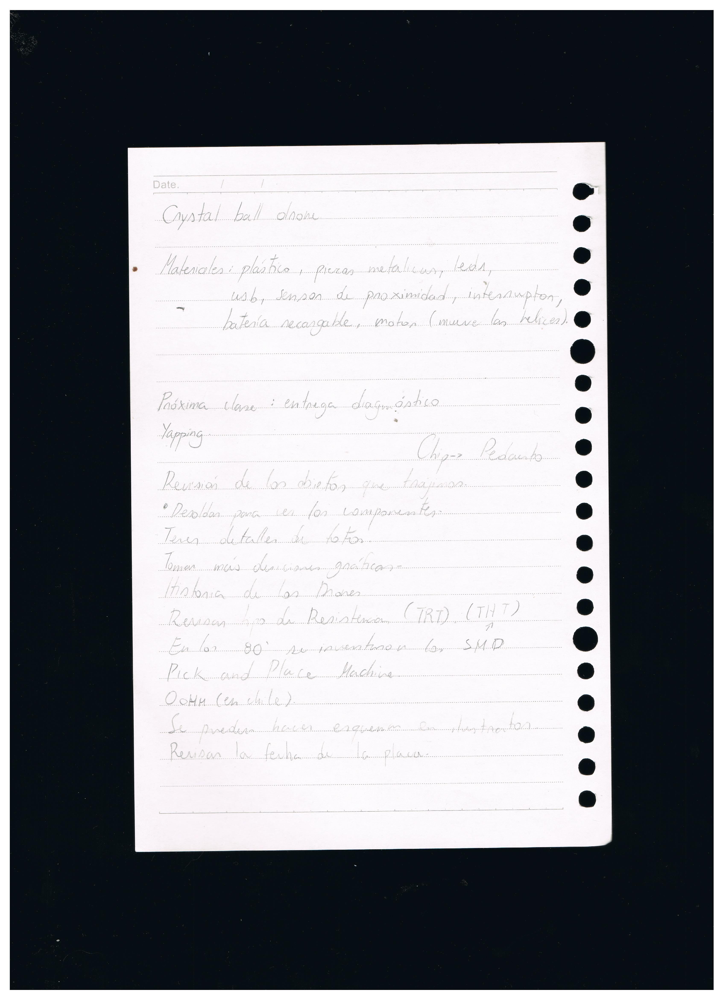
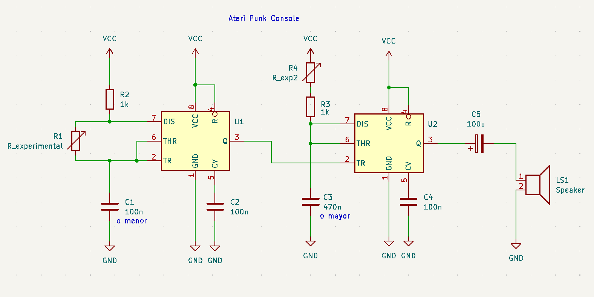
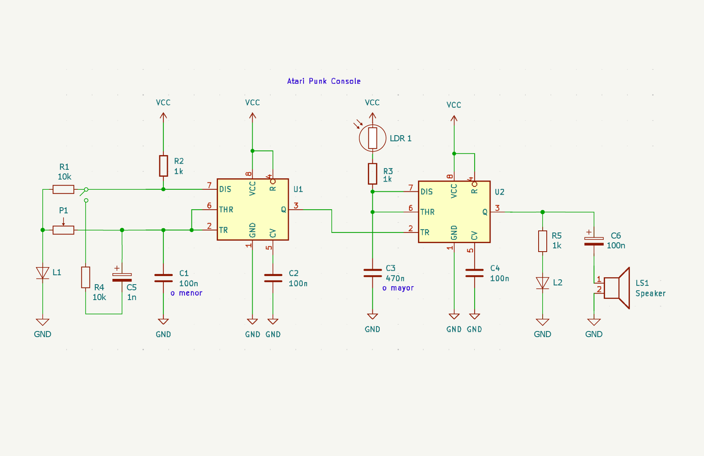

# ⋆₊˚⊹♡ Clase 05a - Desarrollo Atari ♡⊹˚₊⋆

Martes 8 Abril 2025

***

## Observaciones

Esta clase comenzó con una charla sobre salud mental, lo que personalmente me generó más confianza con la clase y el equipo docente, puesto que tengo bastante ansiedad antes de comenzar y me armo de valor para poder levantarme e ir a presentarme a la facultad.

Luego de ello, se invitó a los grupos de alumnos a presentar los objetos escogidos y en profundizar en las investigaciones, a modo de compartir descubrimientos generados al utilizar ingeniería inversa para el estudio de la composición de los componentes y los circuitos de estos productos y poder hacer paralelismos con los conocimientos adquiridos las sesiones pasadas.

Los primeros objetos expuestos, en conjunto con las presentaciones de mis compañer@s me inspiraron a querer presentar mis descucrimientos, lo que a mi sorpresa tuvo una buena recepción pese a sentir que no me enfoqué demasiado en el circuito sino más en el empaque, funcionamiento y algunos componentes. Actualmente intenté separar las piezas con un cautín sin éxito, pudiendo hacer más difícil el concluir con la investigación. Volviendo a la presentación, se me aclaró que los fabricantes suelen borrar los códigos o nombres de las piezas que usan con la finalidad de imposibilitar la replicación de el circuito, con tal de no informar a la competencia sobre el desarrollo del producto en cuestión.

Una vez terminadas las presentaciones, el resto de la clase se enfocó nuevamente en el circuito Atari Punk Console, puesto que para la tercera semana de abril se palnificó un diagnóstico que tiene como objetivo el generar al menos 3 intervenciones a lo largo del circuito, buscando generar nuevas propuestas funcionales e impulsar el estudio y desarrollo de proyectos independientes.

***

### Escaneo de bitácora y apuntes escritos del día

***

### Avances para la clase 05b

#### _Atari Punk Console Editada_

Para poder comenzar el proyecto en sí, decidí enfocarme en lo que llevo haciendo durante varias clases: analizar el diagrama del circuito, con la finalidad de comprender la composición y orden de las piezas, buscando simplificar lo más posible el montaje en la protoboard para poder realizar la mayor cantidad de modificaciones posibles en el espacio disponible. Para ello me inspiré de este video que enseña el montaje de dicho sintetizador: <https://www.youtube.com/watch?v=c-Rlr_UjkmY>

Diagrama entregado en clase. Obtenido de: <https://www.build-electronic-circuits.com/atari-punk-console/>

La primera parte decidí centrarme en ir poco a poco fabricando el circuito, comenzando por preparar la mitad de este y ponerlo a prueba.

Primer avance: una mitad

Tras observar que el circuito funcionaba sin problemas, decidí terminar el montaje usando 2 sensores LDR como resistencias experimentales.

Circuito original completo

Ya lista la estructura base, decidí reemplazar la primera resistencia por un potenciometro, con la finalidad de poder controlar de mejor manera los sonidos emitidos. En ello implementé cables dupont hembra-macho para extender fuera del tablero esta pieza. Por suerte pudo funcionar sin problema.

Circuito levemente modificado

Como ya había podido usar con anterioridad los potenciómetros, pudiendo tener una comprensión de su uso antes de este proyecto, pues decidí generar un circuito que pudiera funcionar con un interruptor que se separe en 2 caminos. Para ello quise usar un potenciometro y un condensador, además de resistencias. Este fue un proceso de prueba y error, dado que pese a investigar y buscar videos que me enseñaran el funcionamiento de un interruptor en un circuito, no conseguí hasta varios intentos que estos caminos pudieran ser funcionales.

Los videos que consulté fueron estos:

- <https://www.youtube.com/watch?v=G9vC1YbZm8I>
- <https://www.youtube.com/shorts/5stI4cYxgeU>
- <https://www.youtube.com/watch?v=9zNY_4g44Rw&t=129s>

El primer camino está compuesto por un led rojo, una resistencia de 10k y un potenciometro que reluga la intensidad de la luz y del sonido emitido.
El segundo posee otra resistencia de 10k más un capacitor electrolítico de 1n. Ambos caminos terminan conectados a el pin 2 del chip 555.

Otra de las modificaciones que realicé, fue definir como segunda resistencia variable a un sensor LDR.
Por otra parte, generé una conexión paralela aprovechando el espacio restante en el output de esta caja negra, incluyendo una resistenciade 1k y un led de color verde.

Circuito modificado

Para tener una mayor comprensión del circuito y los lenguajes de montaje quise realizar las modificaciones al diagrama anteriormente mostrado, buscando signos que representaran las piezas que incluí y los caminos creados.

▼ Diagrama del circuito modificado

#### Bill of materials (BOM)

| Componente       | Qty | Nombre(s) | Valor/tipo |
|-----------------------|---------|------------|----------------|
| Chip 555              | 2       | U1, U2     |                |
| Batería               | 1       | Sin nombre |       9V       |
| Resistencias          | 5       | R1, R2, R3, R4, R5     | 1k, 10K  |
| Condensadores         | 6       | C1,C2,C3, C4, C5, C6   | 1n, 100n, 470n |
| Parlante              | 1       |  LS1       |      2w        |
| LDR                   | 1       |  LDR1      |   1k ~ 10k     |
| Leds                  | 2       |  L1, L2    |   3,3V    |
| Interruptor           | 1       |  Sin nombre    |    30mΩ    |
| Potenciometro         | 1       |    P1      |    500K    |

***

### Posdata

No se porqué, pero siempre dejo el escribir estos códigos para la madrugada... creo que debo replantearme mis hábitos para no empeorar mi salud ૮◞ ﻌ ◟ა

***

°˖✧◝(⁰▿⁰)◜✧˖°
