# ⋆₊˚⊹♡ Clase  08a - Revisión de Kicad, programas y atajos para trabajar desde el PC ♡⊹˚₊⋆

Martes 29 Abril 2025

***

## Observaciones

En esta clase continuamos aprendiendo sobre KiCad. En ello se nos informó que todas las imágenes que se suban a la placa tienen que estar en archivos vectoriales (.svg, otros a explorrar). Tras ello comenzamos a hablar sobre la experiencia universitaria de las notas del profesor Aarón con la finalidad de poder saber qué sucederá con las notas. En canva se encuentra la información de las notas de forma precisa.

Luego los profesores explicaron el proceso de exportación y cotización que realizaron con la placa diseñada la clase previa.

Tras el descanso pasaron demasiado contenido, enfocado en varias páginas web y en configuración del pc paa poder editar el repositorio personal de forma independient4e.

Para ello el equipo docente envió un [video](https://www.dropbox.com/scl/fi/xj27wjdz7tz0oq73vrzxw/Screen-Recording-2025-04-29-at-11.08.09-AM.mov?rlkey=4mxo81el3c2mo4se78l4b4hmo&e=1&st=wfg30d6o&dl=0) de todo el contenido pasado en clases.

***

## Bitácora digital

### Parte 1: Revisión de "udpudu"

Hoy fui corriendo a la sala pese a que me sentía un poco mareada después del viaje en metro. Cuando pude llegar e instalarme en la sala identifiqué que estaban revisando el circuito que los profesores mandaron a imprimir en la página [JLCPCB](<https://jlcpcb.com/>), revisando las capas que le componen (serigrafía, cobre, cortes en la placa, etc).
Estos documentos se encuentran en la página "<https://github.com/disenoUDP/dis8644-2025-1/tree/main/00-docentes/sesion-07b/udpudu>".

Dado que la carpeta es bastante grande y posee bastantes archivos y versiones, decidí enfocarme en encontrar un documento con terminación "Zip" que hubiera sido actualizado lo más reciente posible. Por lo que pude ver, hay varrias carpetas con esa descripción que habían sido actualizadas el día anterior. Al final terminé decidiendo por ingresar a la carpeta "udpudu-2025-04-28_225809" y descargar su contenido al hacer click en el archivo y en la opción "View raw".

- Información recuperada de: <https://docs.github.com/es/get-started/start-your-journey/downloading-files-from-github>

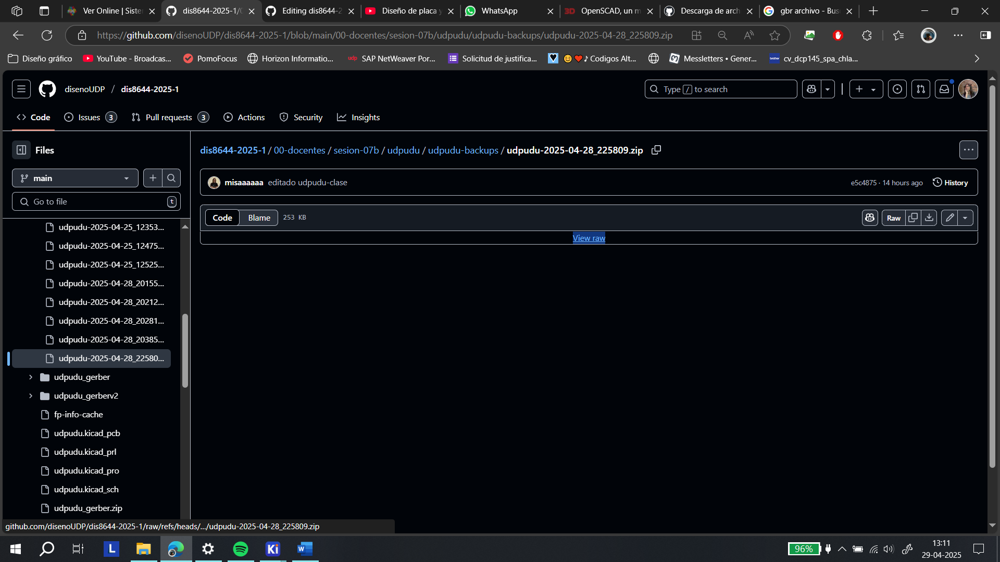

▼ Captura de la carpeta descargada en Github.

Una vez descargada exporté todos los documentos para poder analizar las partes que componen dicho documento.

#### Archivo diagrama

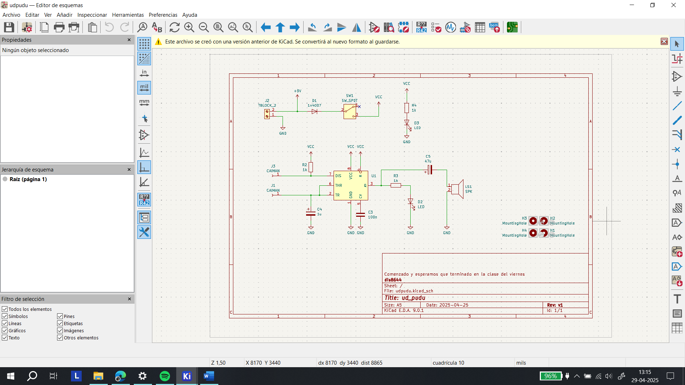

▼ Captura del diagama.

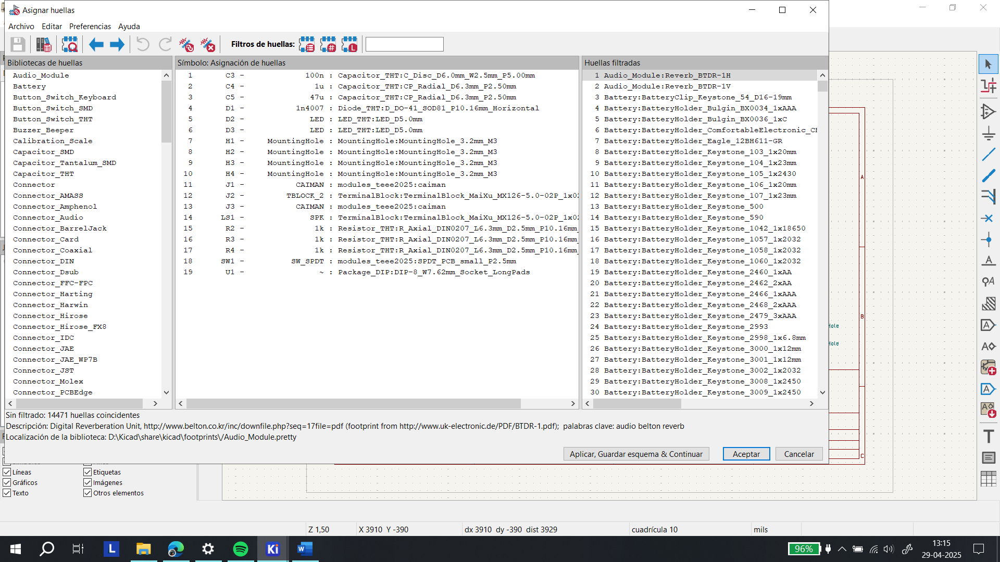

▼ Captura de las huellas del archivo.

#### Análisis 1: 

En comparación con el esquema realizado en clases, a este se les añadió 4 perforaciones (MountingHole) númeradas del H1 al H4. Las huellas de estas piezas son "MountingHole_3.2mm_M3". Por lo que pude apreciar, no es necesario que estos elementos se encuentren posicionados en una parte en específico (no como en la placa PCB). Fuera de eso, el circuito es similar al que realizamos la clase pasada.

#### Archivo PCB

▼ Visualización completa de la placa. Se observa una sobreposición de los elementos delanteros con los de atrás.

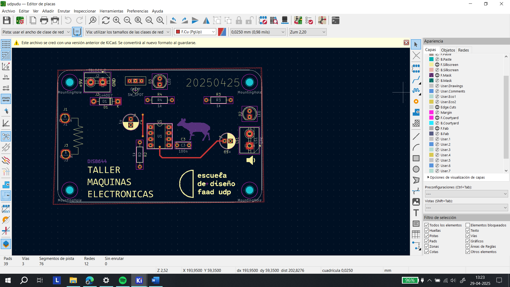

▼ Visualización de la parte frontal (F.) de la Placa (Cu, Silkscreen, Mask, Edge.cuts, Courtyard, Fab).

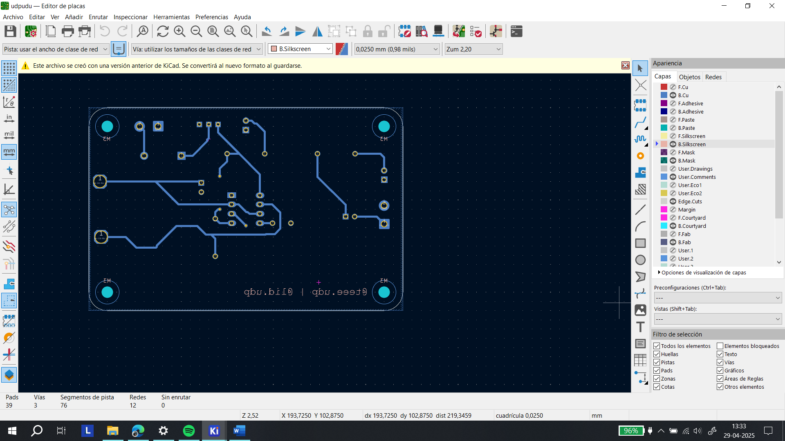

▼ Visualización de la parte trasera (B.) de la Placa (Cu, Silkscreen, Mask, Edge.cuts, Courtyard, Fab).

#### Análisis 2: 

La placa se ve completa y separada por cada parte. Los esenciales son los conectores de Cu (cobre), los cortes de los bordes (dimención del circuito) y los agujeros por donde entrarán las piezas. Sin estos el circuito como tal no sería funcional. Los demás parametros ayudan a generar una guía para sabe en qué lugar se instala qué pieza, para darle un sentido de identidad y estética, entre otros.

#### Simulación en 3D

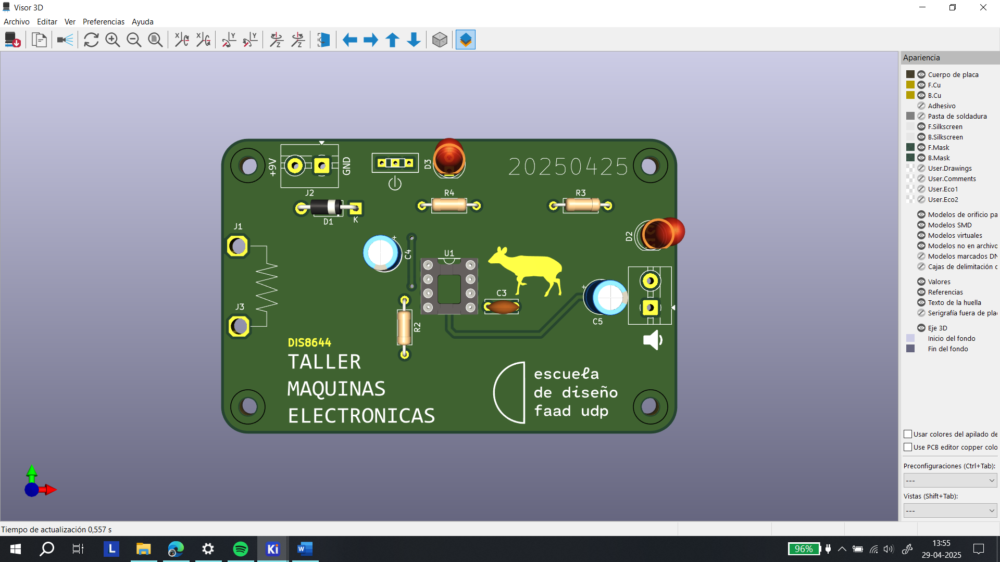

▼ Visualización de la parte frontal.

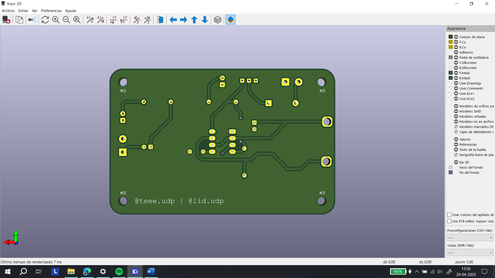

▼ Visualización de la parte trasera.

#### Análisis 3:

Usando esta herramienta se puede ver una aproximación del resultado final antes de mandarlo a fabricar. Es la última oportunidad para poder realizar observaciones y cambios tanto en los componentes como en el circuito como tal.

***

### Parte 2: Programas, páginas, herramientas para poder trabajar desde el PC

**- [OPENSCAD](https://openscad.org/) -**

Es un software CAD (Computer-Aided Design), es decir, un software de diseño asistido por ordenador. ["Esta tecnología permite la agilización del trabajo, automatizando los procesos manuales del proceso de diseño de producto, reduciendo errores, ganando velocidad y aumentando la calidad"](https://9altitudes.es/aprende-y-conecta/articulos/que-es-cad-para-que-sirve-y-que-ventajas-tiene#:~:text=El%20software%20de%20dise%C3%B1o%20asistido,y%20tridimensionales%20de%20objetos%20f%C3%ADsicos).

En este caso, OpenScad es un programa gratuito y de código abierto (cualquiera puede inspeccionar, modificar y mejorar el código fuente) enfocado en ["la creación de modelos 3D mediante la programación. Los usuarios tienen el control total sobre el proceso de modelado, permitiendo modificar cualquier paso en cualquiera de las etapas del modelado, o crear diseños definidos mediante parámetros configurables"](https://www.3dnatives.com/es/openscad-modelador-3d/#!).

**- [MAKER WORLD](https://makerworld.com/es) -**

Es un sitio web colaborativo u portal comunitario creado por "Bambu Lab". Este funciona como una especie de repositorio en el que tanto "Creadores de modelos 3D" como "consumidores" pueden interactuar con Expertos dedicados al sector del modelado y la impresión 3D para poder conseguir los mejores resultados, independiente si se trata de forma virtual (programas, herramientas, errores, etc) o de forma física (enfocados en las impresoras y máquinas). Son muchas las formas de prestar ayuda a quien acude al sitio, reduciendo las barreras técnicas.

El fundamento de la creación de esta web es ["La idea de unir las fuerzas de diseñadores, expertos en laminación, proveedores de filamentos y consumidores. Esta colaboración garantiza que no solo los modelos, sino también el conocimiento sobre la laminación y la alegría de la creación se compartan dentro de la comunidad".](https://www.impresoras3d.com/makerworld-el-portal-comunitario-de-bambu-lab/#:~:text=MakerWorld%20se%20basa%20en%20la,compartan%20dentro%20de%20la%20comunidad.)

**- [GitHub CLI](https://cli.github.com/) -**

   (descargar carpetas de Github)

- <https://github.com/oskitone/poly555> (Oskitone - proyectos con cada pieza)

***

#### Oportunidades: Google Summer of Code 2025

<https://summerofcode.withgoogle.com/>

***

### Salida a terreno independiente: Tiempo de decaimiento temprano

Exposición realizada por el Núcleo de Artes Sonoras: Mónica Bate, Jorge Cabieses, Rainer Krause, Francisco Sanfuentes, Matias Serrano, Lucas Soffia.

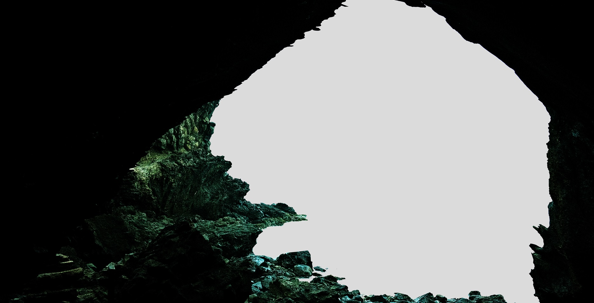

▼ Imagen encontrada en la página de la exposición. Recuperado de: https://mac.uchile.cl/exposiciones/tiempo-de-decaimiento-temprano/.

El día de la inauguración tuvimos clases, por lo que me quedé toda la tarde en la universidad haciendo la hora para poder asistir. Dado que la hora a la que comenzaba el evento era muy tarde y me daba nervios ir sola quise invitar a mi novio. Me gusta poder compartir momentos con él, me hace sentir acompañada y querida, y aprovecho de poder interactuar frente a nuestras agendas y la realidad.

Una vez llegamos al lugar vimos que había mucha gente, siendo una convocatoria grande al tener varias muestras que habían sido renovadas (me parece que cerca de 3).
Fui paciente y estuve escuchando los discursos que daban, intentando entender lo que decían las personalidades extranjeras que colaboraron con el museo. Cuando ya hubo “chipe libre” para ir a pasear por el museo sentí exaltación por querer saber qué era lo que nos podía esperar.

Para la posteridad, decidí tomar algunas fotografías de las obras que más me llegaron a gustar de alguna u otra forma.

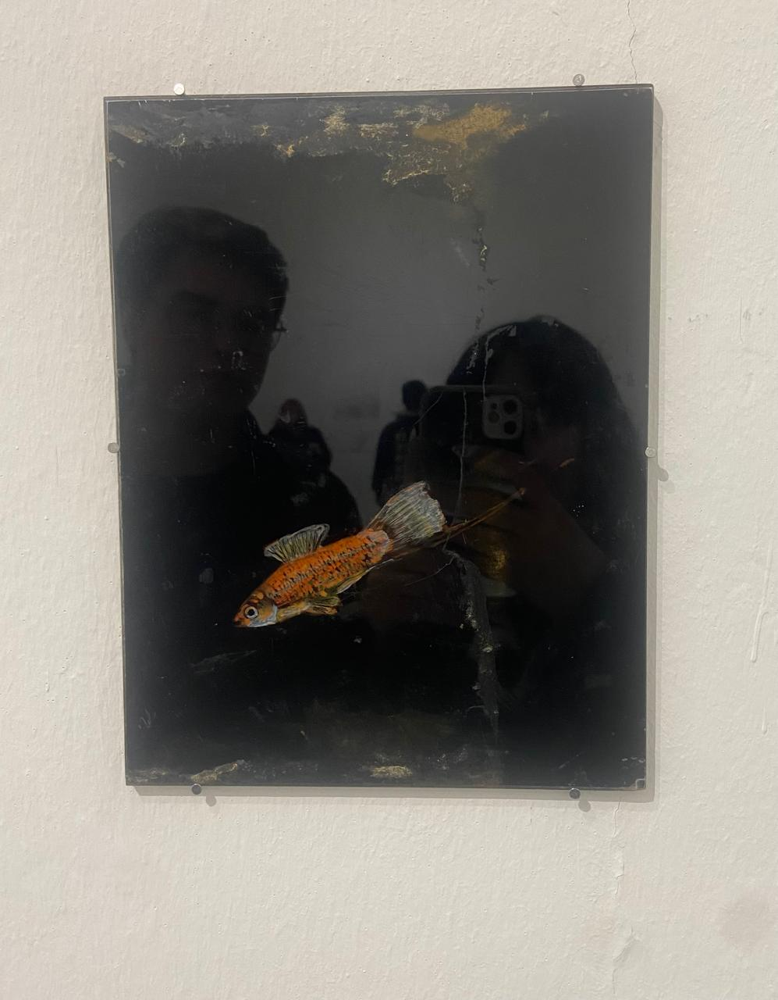

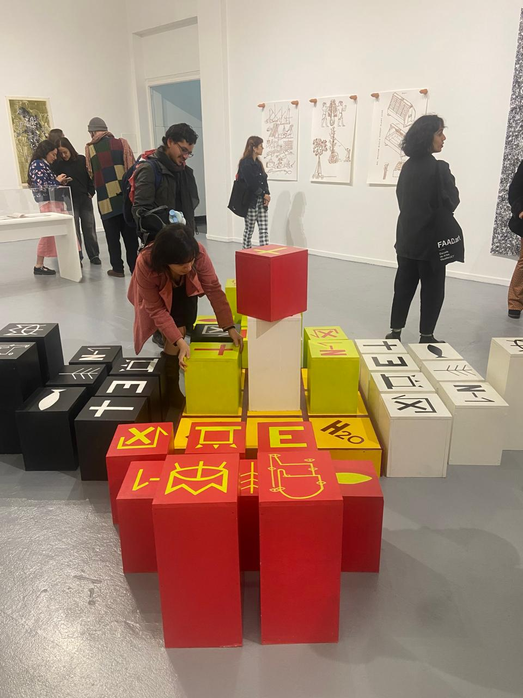

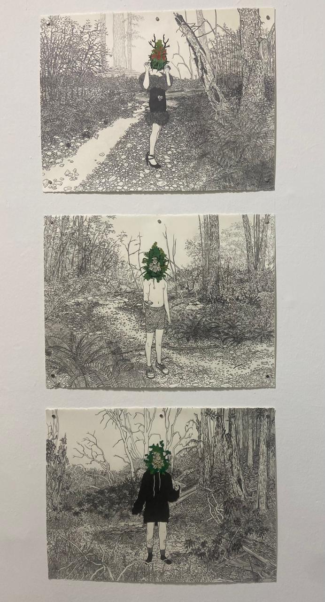

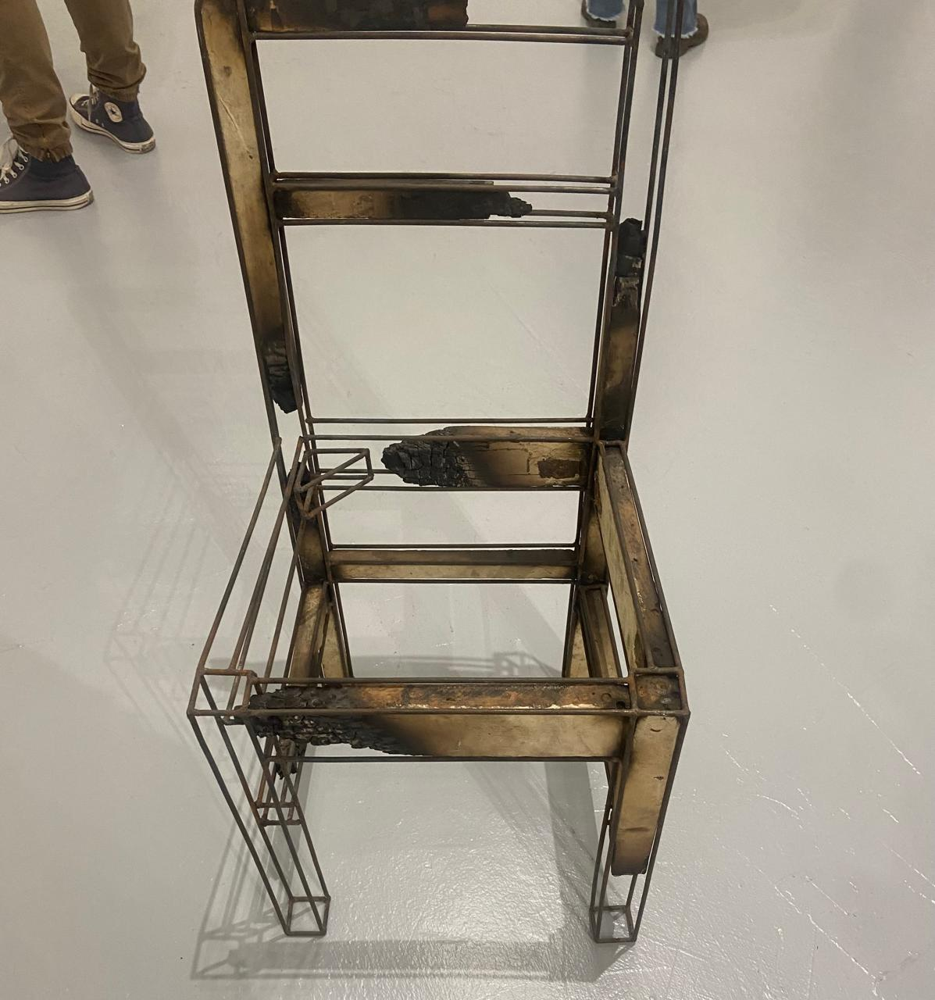

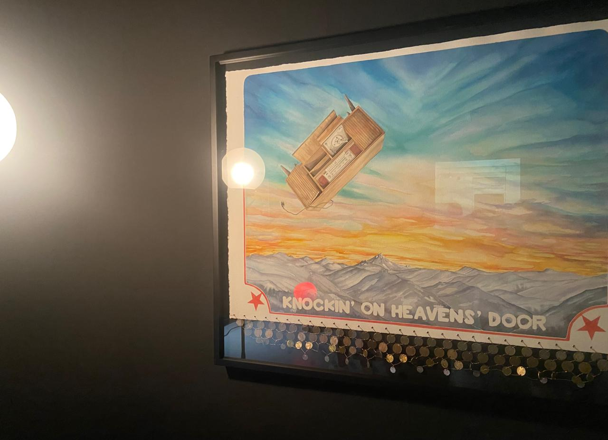

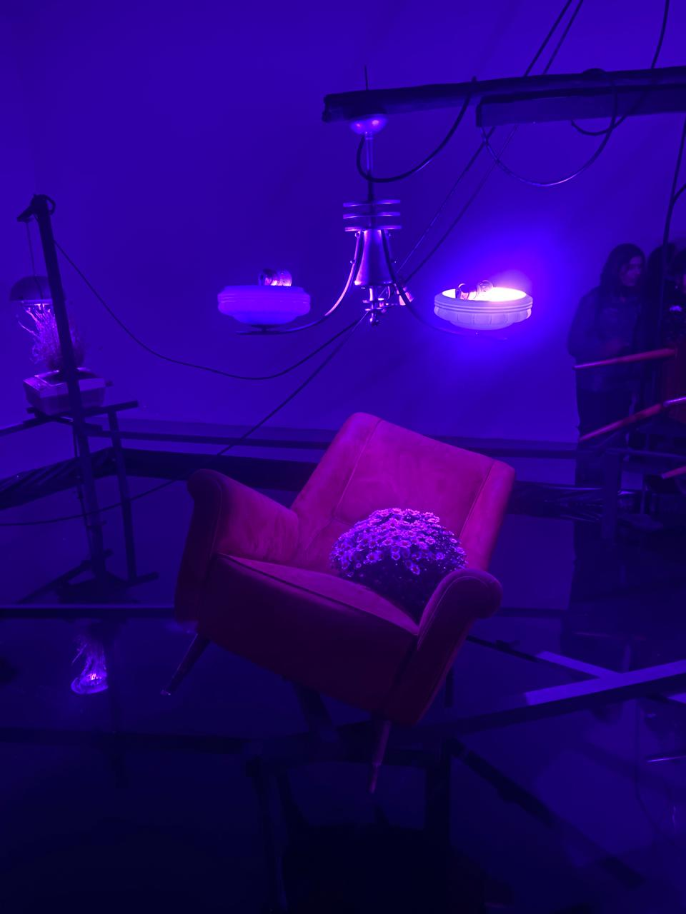

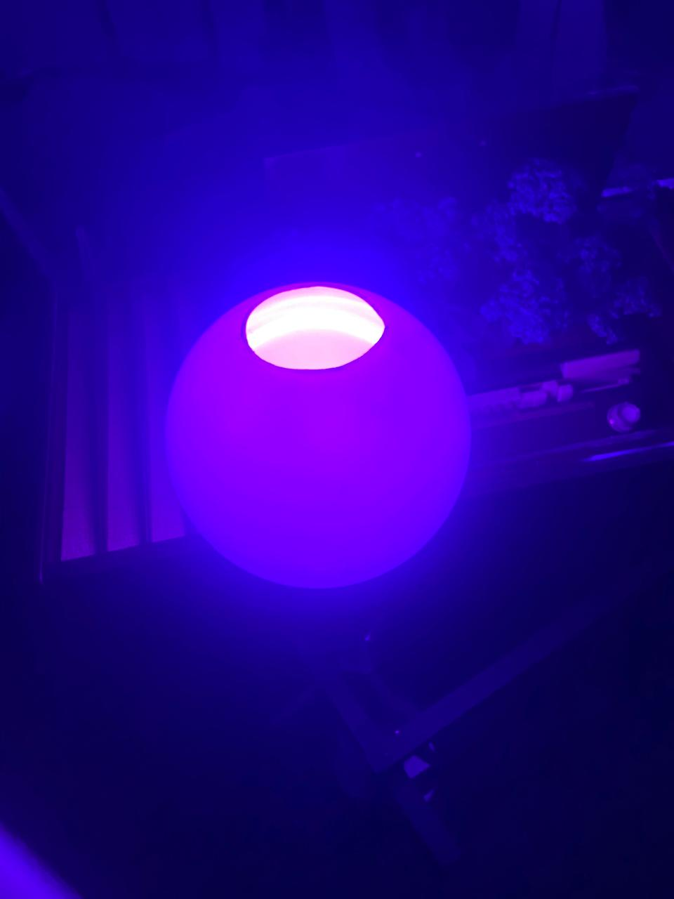

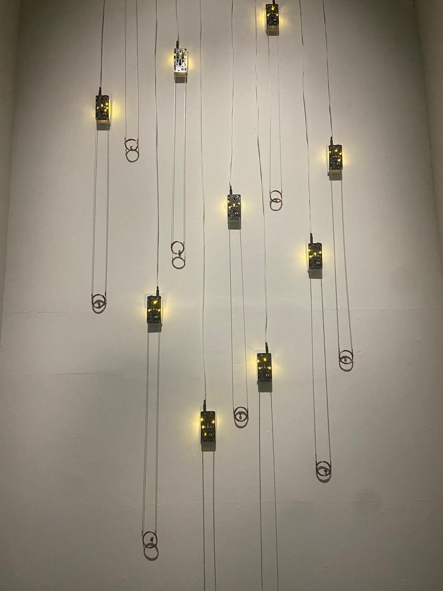

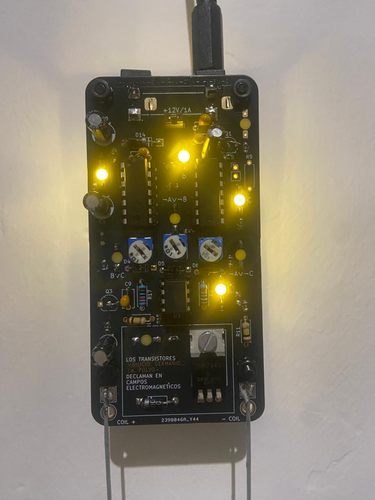

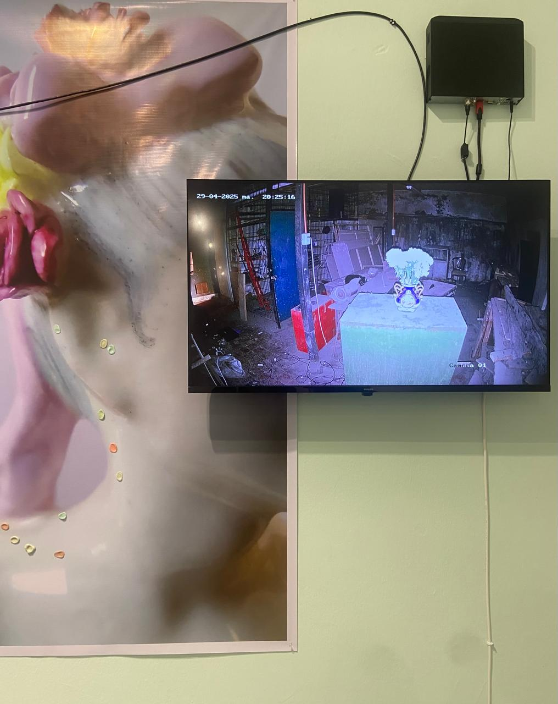

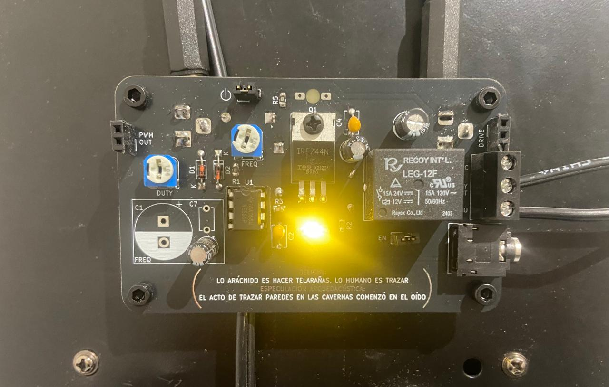

Pude disfrutar bastante de las exposiciones. La sala que más me gustó fue la que tuvo lámparas ultra violeta, me generaba cierta calma y fascinación al ver los objetos en composiciones difíciles sobre una superficie con agua y que a su vez esta tuviera plantas saliendo me gustó.

***

### Posdata

La clase tuvo mucho contenido de golpe, me maree de escuchar y saltar de un lado a otro. Me pondré al día cuando se suba el video. (っ- ‸ - ς)

***

°˖✧◝(⁰▿⁰)◜✧˖°
