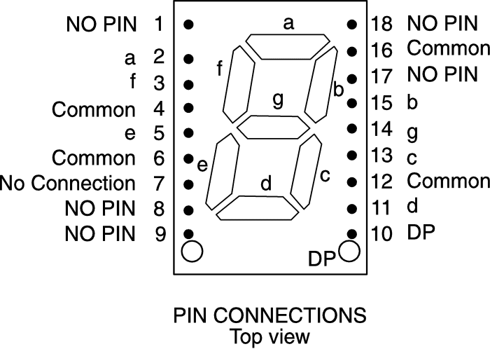
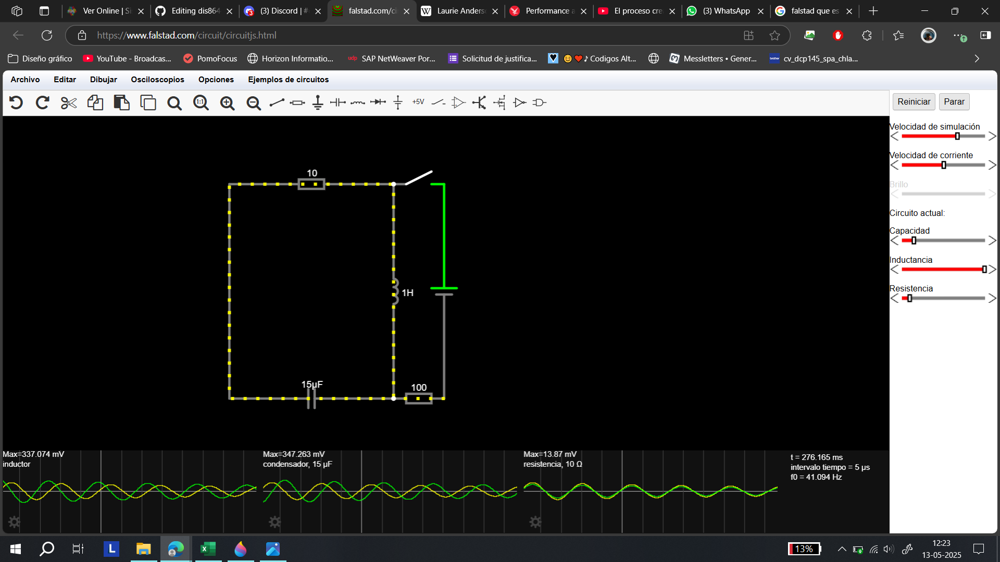
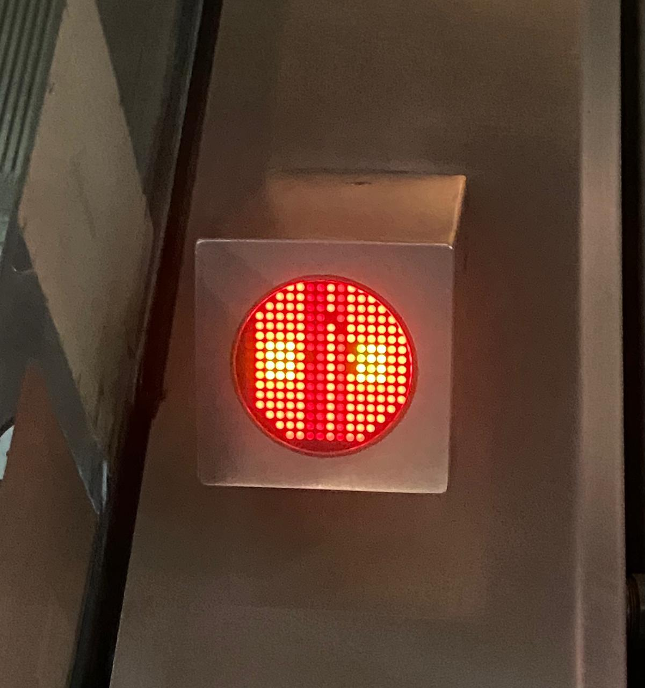
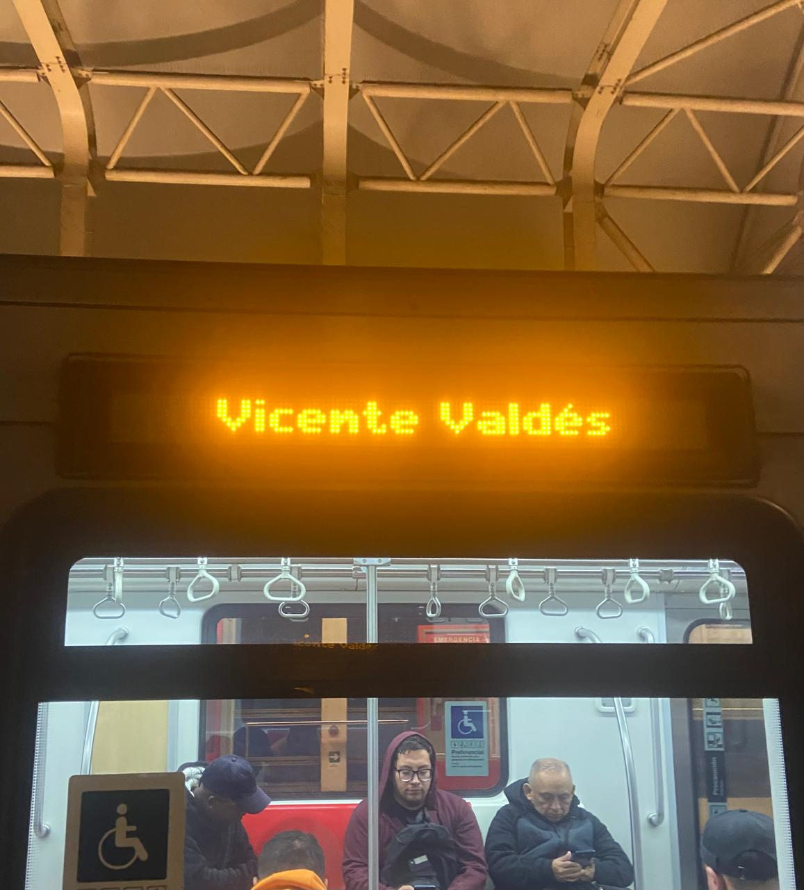
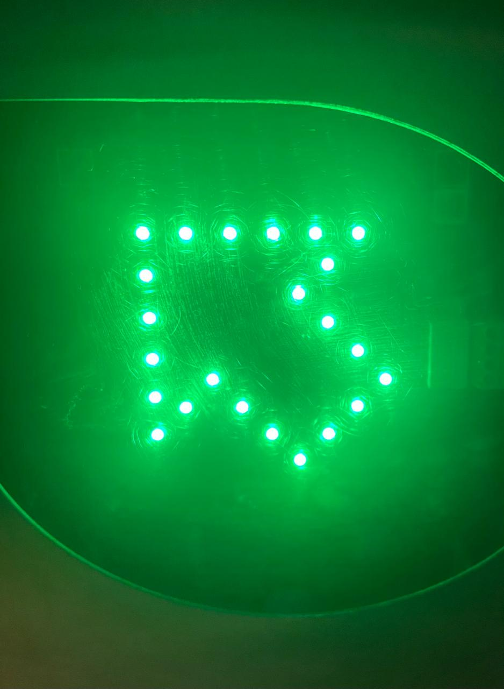
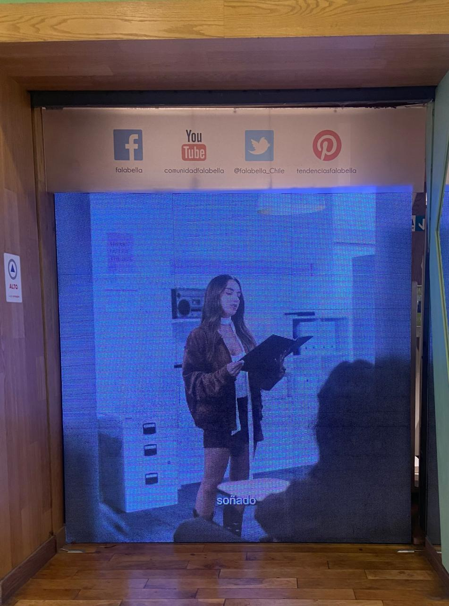
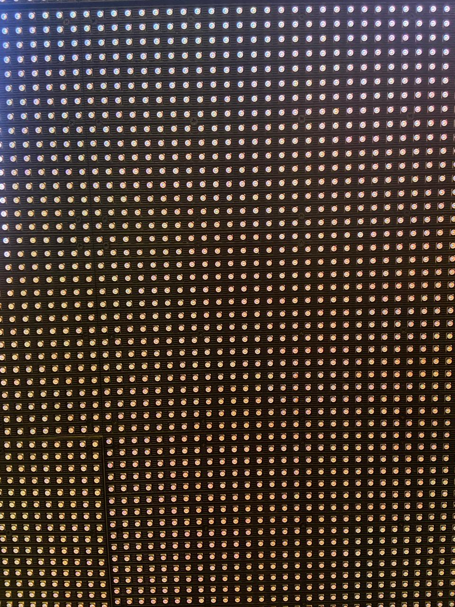
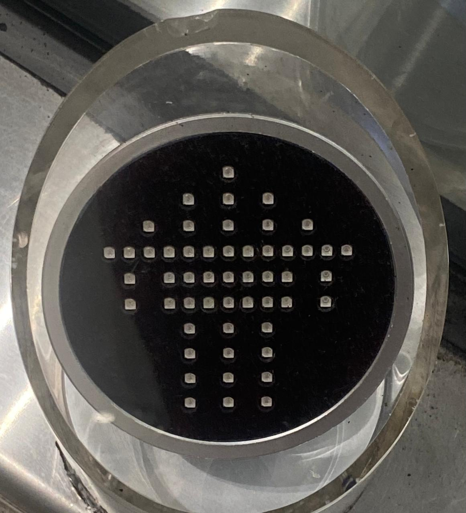
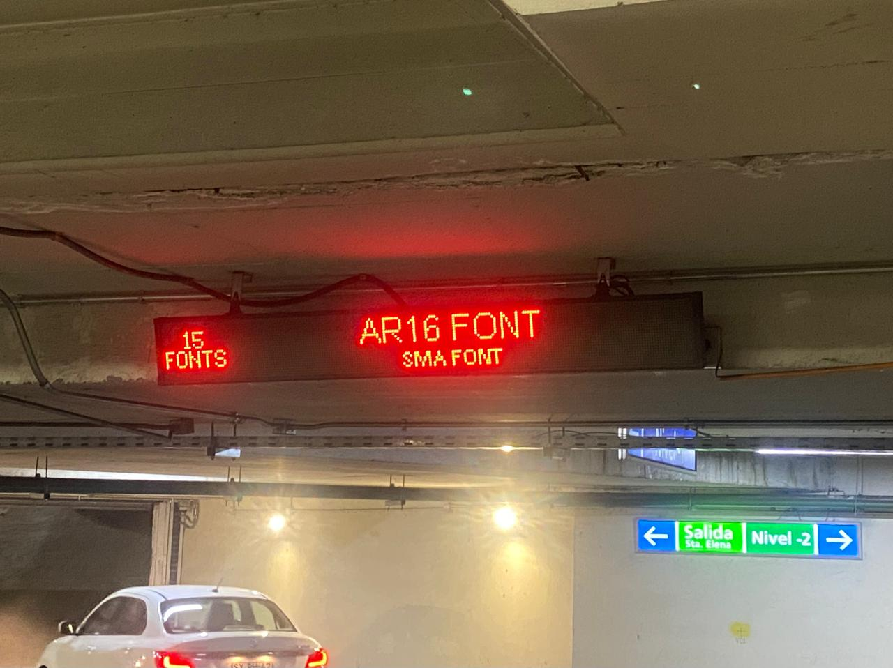
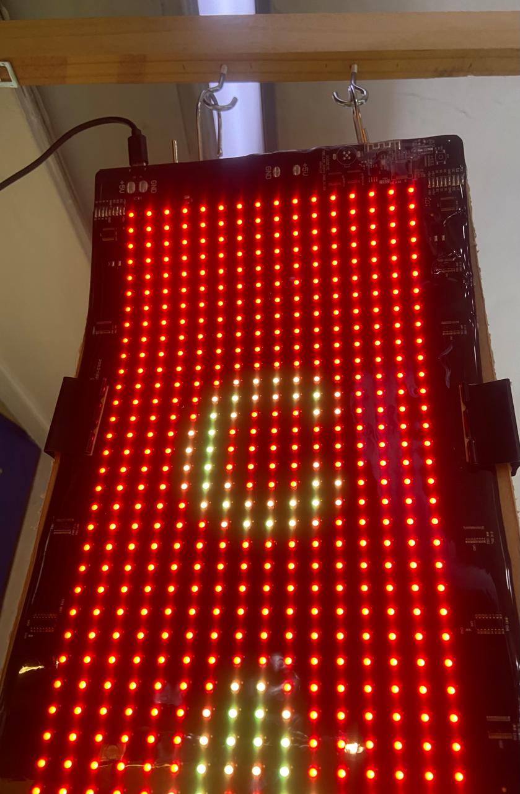

# ⋆₊˚⊹♡ Clase  10a - Circuitos PWM (Pulse Width Modulation) ♡⊹˚₊⋆

Martes 13 Mayo 2025

***

## Observaciones

La clase comenzó con la invitación a la inauguración de la muestra "Hablar con extraños", realizada por el profesor Matias Serrano dentro de la Universidad de Chile.

***

## Bitácora digital

### Parte 1: Montaje del circuito

La clase comenzó con la instrucción de juntarse en grupos de a 3, para poder montar el circuito visto la clase pasada, con la modificación de que cada circuito iba a poseer un color en particular: 1 rojo, 1 verde y 1 azul. En mi caso personal escogí el verde, mientras que mis compañeres eligieron los otros colores.

En mi caso personal, me costó bastante el montar el circuito, por lo que terminé por rehacerlo completamente al ver que no podía controlar la intensidad de la luz del LED. Al segundo intento Félix me ayudó a revisar cuál podía ser la causa, y modificando el orden de los cables aplicados al pin 2 y 6 del chip 555,  el cambio de ubicación del condensador cerámico "104" y volviendo a conectar la energía a los diodos con el potenciometro y el cable. Como último, la resistencia conectada al led se cambió de 1k a 220 ohm. Ello tuvo como efecto que el circuito pudiera regular la intensidad de una luz que anteriormente nse veía opaca y estática.

Una vez alterado el circuito nos dedicamos a unir todos los leds debajo de una hoja semitraslucida (hoja de cuaderno), cuyo efecto se comenzó a apreciar ante nuestros ojos: una rosa cromática efectuada por los colores de los leds RGB.

<https://github.com/user-attachments/assets/897c7db9-0f6a-46ee-8020-10af393c79c5>

Video del resultado. Obtenido del Discord del curso

Para llegar a esto hubo que corregir y ajustar los valores de cada LED, teniendo las mismas resistencias e intensidad de la luz. Este efecto se produce como parte de la teoría del color.

A su vez se mencionó los "Leds RGB", los "Leds de 7 segmentos". Encontrar display de LEDs (Un dispositivo que tenga LEDs incrustados, como un semáforo).

▼ Diagrama Leds de 7 segmentos. Obtenido de [RS](https://cl.rsdelivers.com/product/broadcom/hdsp-n151/display-led-7-segmentos-broadcom-de-1-caract-rojo/2465522).

Tras ello hablamos sobre Descartes, el plano cartesiano, la geometría analítica, la lógica, meditaciones, etc.

Teoría del color, modo sustractivo y aditivo.

***

#### Parte 2: [Falstad](https://www.falstad.com/circuit/circuitjs.html)

Dado que llegué unos minutos tarde por atender un asunto personal, me perdí gran parte del conocimiento que se estaba impartiendo. De la información que obtuve, vamos a trabajar con Amplificadores operacionales (LM324, LM358), por lo que se nos explicó la teoría del funcionamiento de estas piezas desde la física.

Además, se realizó una simulación en Falstad, una plataforma web basada en Java que simula circuitos eléctricos análogos y digitales, (dibujandolos de forma intuitiva) y demuestra distintos parámetros de forma visual mediante gráficos que se van actualizando continuamente.

***

### Encargo 20: Pantallas de siete segmentos

▼ Fotografía totem de entrada y salida República 180. Fotografía tomada el  13 de mayo del 2025.

El contexto de esta imagen fue parte del trabajo de clases, en el que durante el descanso de la clase tuvimos que ir a recorrer el barrio para obtener fotografías de pantallas de 7 segmentos. Esta pantalla parece estar conformada por leds de color verde, las cuales tienen encendidas ciertos focos que feneran una flecha (lo que indica que se puede pasar).

▼ Fotografía mini pantalla de leds. Fotografía tomada el 21 de marzo del 2025.

El día en el que tomé la fotografía tuvimos clases. Dado que había realizado una compra en MCI electronics <https://mcielectronics.cl/> tuve que ir a retirarla a su sucursal ubicada en Providencia.

Al momento de dirigirme a la caja pude encontrar este pequeño cartel que indicaba el sector. Me pareció simpático, por lo que le tomé una fotografía con la finalidad de poder saber que era esta pantalla y adquirir una, dado que en el local no las vendían (según me contó la vendedora, las tenían guardadas hace años).

En este caso la pantalla presenta un nivel mayor de complejidad, puesto que requiere de una mayor cantidad de Leds para poder escribir un mensaje (coln palabras y signos). Ello lo hace mejor para comunicar ideas.

Más tarde, ya el 11 de junio del presente año, logré recopilar imágenes de más circuitos que trabajan con leds e imagen o texto mediante estos.

▼ Señal de escalera de metro. Fotografía tomada el 16 de mayo 2025.

▼ Letrero en vagón del metro. Fotografía tomada el 16 de mayo 2025.

▼ Flecha del torniquete del metro. Fotografía tomada el 16 de mayo 2025.

▼ Parte de la caja del metro. Fotografía tomada el 22 de mayo 2025.

▼ Pantalla de leds de tienda reatil. Fotografía tomada el 22 de mayo 2025.

▼ Detalle de la pantalla de leds de tienda reatil. Fotografía tomada el 22 de mayo 2025.

▼ Parte de una escalera mecánica. Fotografía tomada el 22 de mayo 2025.

▼ Letrero de aviso en estacionamiento. Fotografía tomada el 23 de mayo 2025.

▼ Cartel de tienda de juegos de mesa. Fotografía tomada el 29 de mayo 2025.

***

### Posdata

Pese a la poca energía que presentaba, decidí ir. Quiero seguir progresando  ૮ ◞ ﻌ ◟ ა

***

°˖✧◝(⁰▿⁰)◜✧˖°
