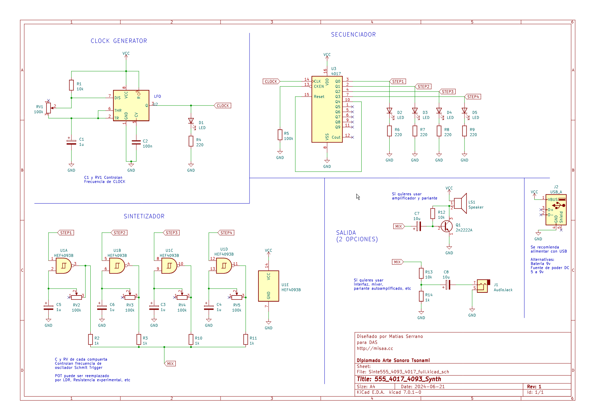
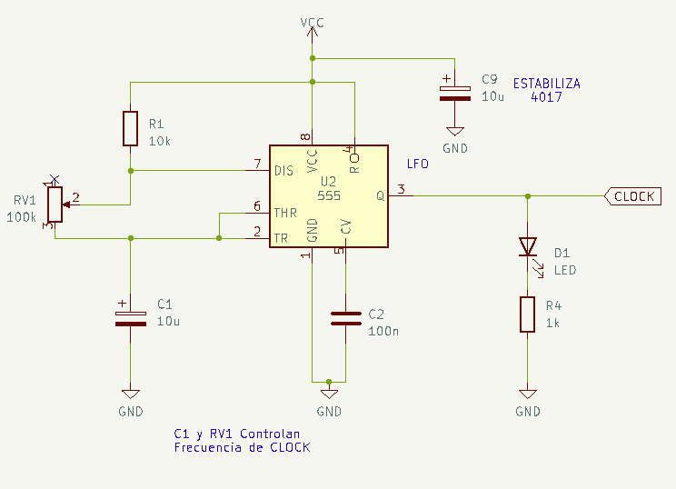
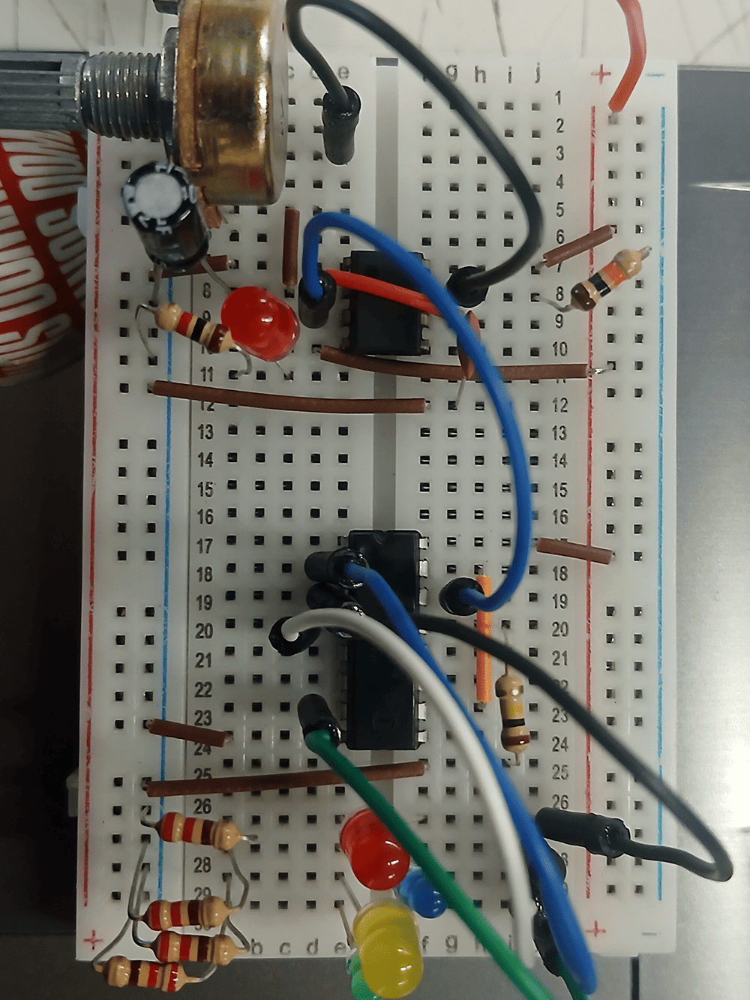
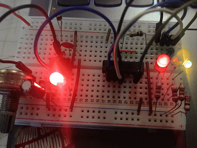
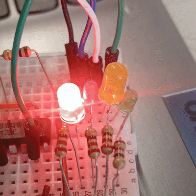
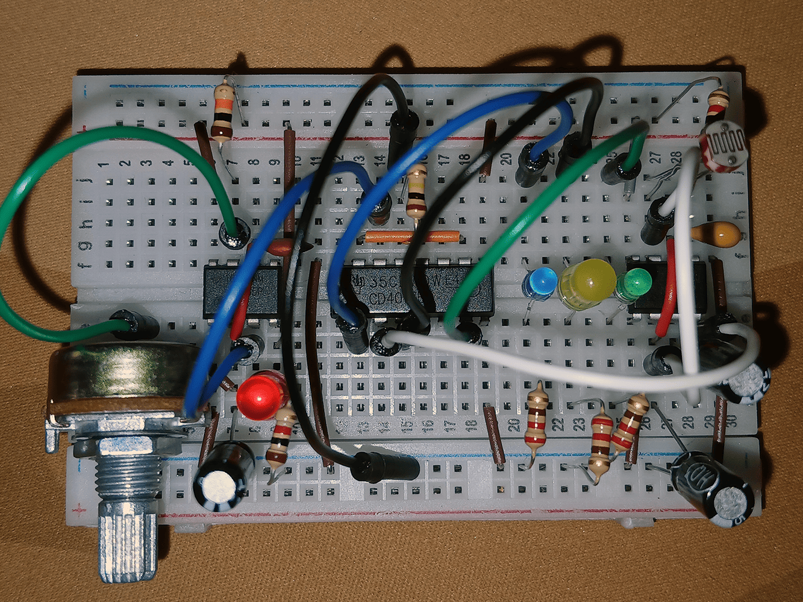
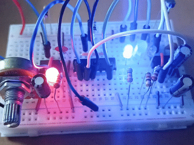
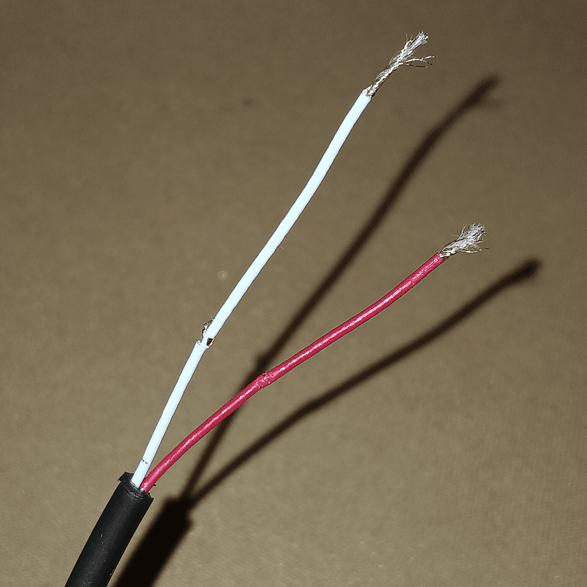

# sesion-11b

[23 de mayo del 2025]

## Teloneo

> Trump administration kicking immigrant students out of Harvard. A new law made it so Harvard doesn't accept foreign student visas

Hoy vamos a soldar para  terminar el udpudu

Aprender a "salir"??? a usb: another power source

Hail to the Thief de Radiohead (Johan reference 🗣️🗣️🗣️)

> Alcanzamos 4k commits en el GitHub

## Apuntes

- Nuevo chip: IC 4017, 16 patas

- Pata 3 del NE555: temporizador, entrega 0 o X volts, alterna entre GND y el voltaje de alimentación

- Lógica secuencial y lógica combinacional en la electrónica, en la combinacional, la salida depende directamente de la entrada via f(x) functions

- LED secuenciador de tipo 4017, NE555 output se conecta al Clk (clock) (pata 14) del 4017. Makes a sequence, 0 to 9. Solo una luz encendida al mismo tiempo

- Software de semáforo SUCKS dice Aarón

- Clk no tiene por qué ser regular. Detecta el edge rising (cuando la señal input pasa de de un low state a un high state)

- Vamos a armar el [4-step SQR synth](https://www.github.com/misaaaaaa/4stepSQRsynth/blob/main/seq4pasos.pdf) que está en el hub de Misaa

- Pata 16 es VCC, same pin counting as NE555

- Muchos chips comienzan con 40 i.e. 40XX

- Pata 8 es GND

- 15 es Reset, se conecta reset a la siguiente pata para resetear el loop, tipo loop de 4 y se conecta a la quinta en la secuencia

- 3 2 4 7 10 1 5 6 9 11 &#8594; pin to step order

- 13 es Cken (clock enable), lo conectamos a tierra con una resistencia entre medio

- Diagrama de Clock Enable tiene un círculo que ???

>
    When it is “0” logic, the clock will get enabled, and the counter advances one count for each clock pulse.
    But when “1” logic, the clock input is stopped, and the counter will do nothing even when a clock pulse arrives.

([ElecCircuit.com](https://www.eleccircuit.com/ic-4017-datasheet/))

- Clock diagrama tiene una flecha hacia el chip

- We ignore Cout for the time being (pata 12)

- Hoy vamos a usar las patas 3 2 4 7 y reseteamos en 10, 1 5 6 9 11 y 12 empty

&darr; Video del cambio con el potenciómetro &darr;

    Durante la clase no conseguía que me funcionara el circuito final (i.e. los LEDs no se encendían), aún colocando un circuito de LED y una resistencia completamente aparte no funcionaba, creí que me eché el protoboard. En mi casa me di cuenta que simplemente tenía los LEDs colocados mal así que por eso ninguno funcionaba lol

    A pesar de que conseguí que se encendieran los LEDs, no me funcionó el circuito final en sí, el parlante no sonaba y se calentaba muy rápido. Volví a hacer el circuito y seguía sucediendo, no sé qué habré hecho mal

- USB-A: GND D+ D- 5V (D being transferencia de datos)

Caja Faraday: estructura metálica que protege contra campos eléctricos estáticos y electromagnéticos. Por esto los microondas son de metal, y no hay señal dentro de los ascensores

En la clase, Misaa peló un cable como ejemplo y mostró que eran 4 cables por cada pin del USB, pero mi cable solo tenía DOS (uno rojo y uno blanco, as opposed to negro, blanco, verde, y rojo)

Aarón me dijo que algunos cables USB son solo de carga así que no necesitan los de transferencia de datos, lo cual hace sentido considerando que mi cable era de un cargador viejo

Conecté el USB a mi computador para ver si funcionaba como batería. En la proto hice un circuito simple de un LED y una resistencia para probar y si bien se encendía el LED cuando conectaba los cables, tenía que encontrarle un punto perfecto para que se mantuviera.

Agarrándolos en un jumping cable no funcionó, tampoco al usarlos directo para el circuito de los dos NE555 + 4017. No sé si el soldarlos ayudará, o si directamente algo hice mal en el stripping.
