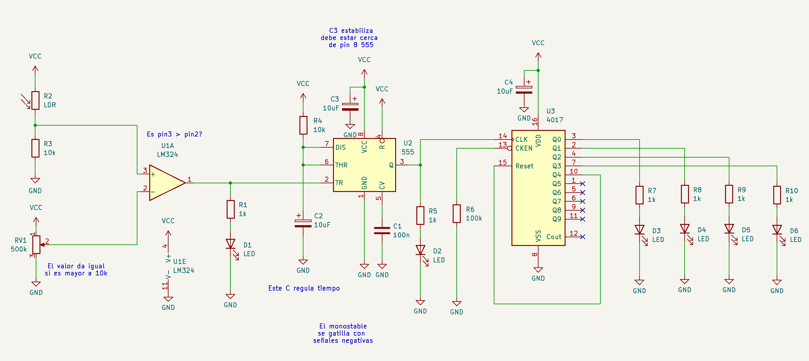
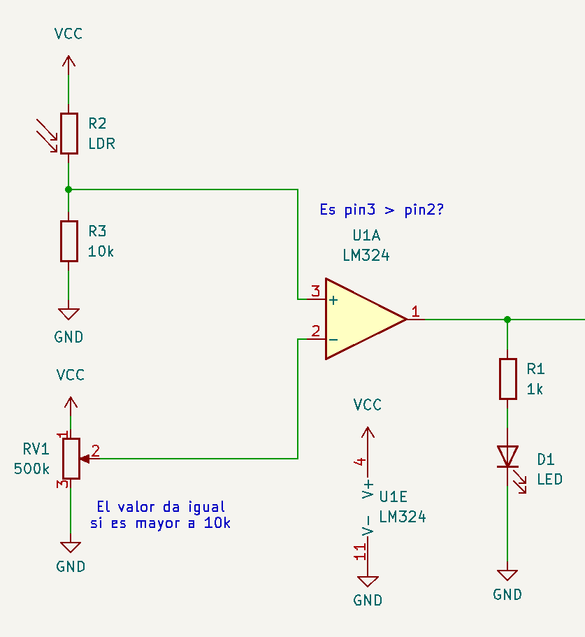
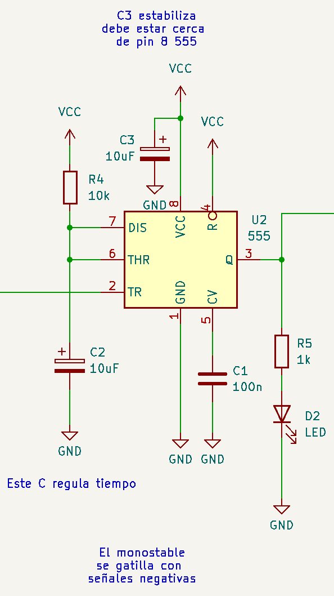
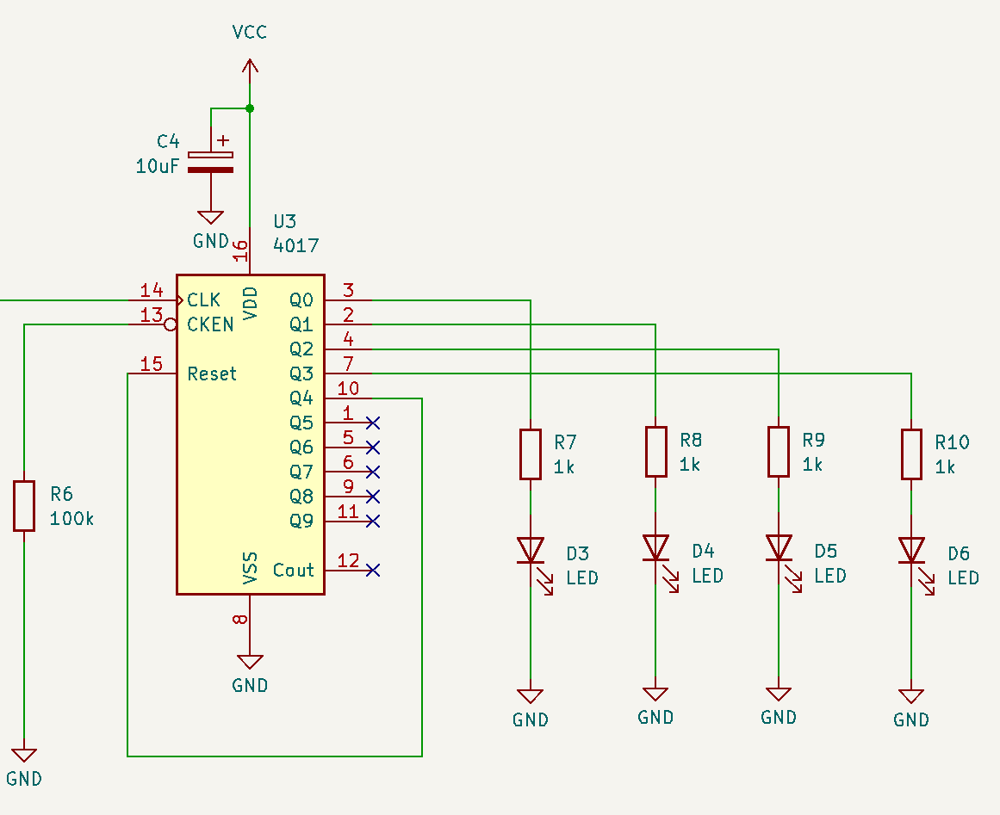
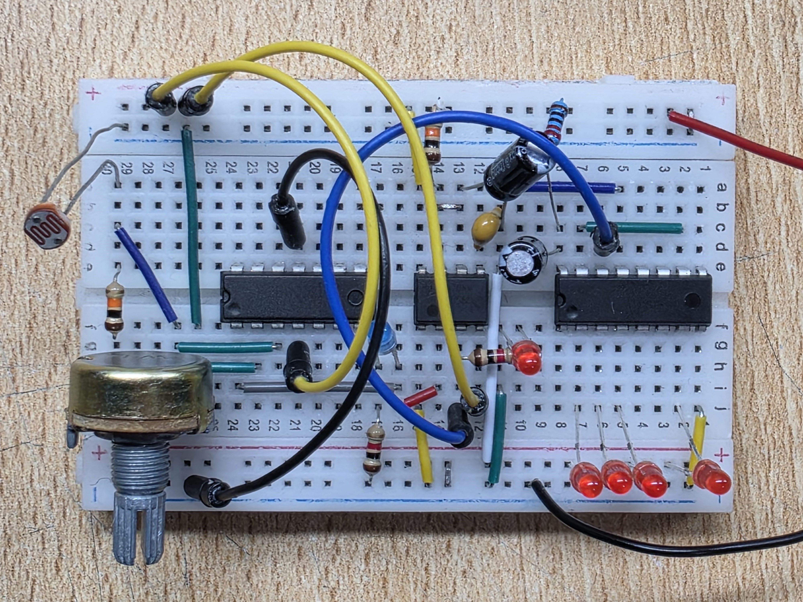

# sesion-12a

## Apuntes

### Semáforo
Misaa nos preguntó cómo podríamos hacer un semáforo con el CD4017, considerando que cada una de las 3 luces se mantiene encendida por un período de tiempo distinto.

Yo propuse hacer que el output 1 active un transistor que conecte otro(s) capacitor(es) al circuito astable (555) que lo haría funcionar, efectivamente cambiando la frecuencia a la que corre el circuito, variando el tiempo que se mantiene encendida cada LED.

@SebastianSaez1003 propuso conectar múltiples outputs a un mismo LED para variar el tiempo que permanecen encendidos cada uno, sin embargo, nos dimos cuenta que la cantidad de outputs no serían suficientes 

Misaa propuso utilizar el pin __Clock Inhibit__ para extender el tiempo de encendido

### [CD4017 datasheet:](https://www.ti.com/lit/ds/symlink/cd4017b-mil.pdf?ts=1749282389151&ref_url=https%253A%252F%252Fwww.google.com%252F)
* Velocidad normal de operación de 10Mhz con 10V
* Contador de décadas
* Contador binario
* Divisor de frecuencia
* Controlador de timers y contadores
* __Clock Inhibit__: Detiene el contador, mantiene el output actual, hasta que sea conectado a __GND__
* __Reset__: Vuelve a contar desde 0 si recibe una señal __HIGH__
* __Carry Out__: después del output 9 emite un pulso para señalar que completó un set de 10 haciendo que, junto con otros CD4017, puedan contar más allá de 10, 100, 1000, etc. (cascading) 

### [W3 schools](https://www.w3schools.com/)
Sitio web educativo y __gratuito__ con tutoriales, ejemplos, ejercicios y otros recursos para aprender varios lenguajes de programación. </br>
Similar a [__Exercism.org__](https://exercism.org/) pero __W3__ se enfoca más en tutoriales y guías, mientras que __Exercism__ se enfoca en practicar

### HTML
Agregar imágenes con texto alternativo:
````

````

### Circuito detector de sombras
Circuito que detecta cuando le hacen sombra y avanza un contador de 4 dígitos (LEDs)


### Parte 1: Input 


Fuente: [Misaa.cc](https://misaa.cc/)

El primero de los 3 circuitos que conforman el circuito del detector de sombras.

El circuito utiliza un __LDR__ conectado a una resistencia para formar un divisor de voltaje, esto se hace porque nos permite variar de forma __mucho__ más importante el valor del voltaje, que si solo usáramos la resistencia variable para cambiar el voltaje. 

El LM324 (comparador) compara el voltaje que sale del LDR y el potenciómetro (conectado como divisor de voltaje) para emitir __LOW__ cuando haya poca luz.

El potenciómetro se usa para calibrar el aparato, ya que en distintos lugares hay distintas luminosidades.

Para evaluar si el circuito funciona o no, se colocó un LED en el __Output__ del comparador.

### Parte 2: Procesamiento


Fuente: [Misaa.cc](https://misaa.cc/)

Este circuito se encarga de tomar el output del comparador, que emite ___HIGH__ por defecto, e invertir la señal, además de incorporar un delay en el cambio de estado del __Output__ del NE555, para evitar que se envíen múltiples pulsos (estabilizar la señal), ya sea por rápidas activaciones consecutivas intencionales o accidentales, o inestabilidad del circuito de la parte 1.

Este circuito también cuenta con un LED para confirmar el correcto funcionamiento de este.

### Parte 3: Output


Fuente: [Misaa.cc](https://misaa.cc/)

El CD4017 cuenta, haciendo brillar un LED tras otro cuando recibe un input del circuito anterior.

El __Output 4__ está conectado a __Reset__, para que al llegar a 4, vuelva a comenzar desde el inicio, evitando que intente encender LEDs que no existen.

### Circuito armado </br>


Fuente: [Misaa.cc](https://misaa.cc/)

Por la falta de espacio en la breadboard, hice unas pequeñas modificaciones, específicamente tratando de las resistencias que van con cada LED, Ya que pensando que el chip debe funcionar como un switch, que deja pasar la corriente que tiene en su pin Vcc a los distintos outputs, poner una resistencia en Vcc debería ser lo mismo que poner una en cada LED (mismo lugar eléctricamente hablando). En la práctica, el CD4017 se comportaba de forma errática al recibir un input regresando hacia atrás el contador y pulsando cuando __Clock__ recibe tanto __HIGH__ como __LOW__.

Parece que este comportamiento fue a causa de la resistencia, ya que al cambiarla por una de menor valor el chip se comenzó a comportar de forma más predecible, aunque al final terminé quitando la resistencia, ya que así funcionaba de forma más estable y los LEDs funcionaban bien.

### Other things: <!-- Things to organize + random stuff -->
> ### Álgebra Booleana
> Inventada por George Boole, es un sistema matemático que funciona en base de __1__ y __0__, gracias a este sistema funcionan las distintas compuertas lógicas que permiten que funcionen los computadores.
